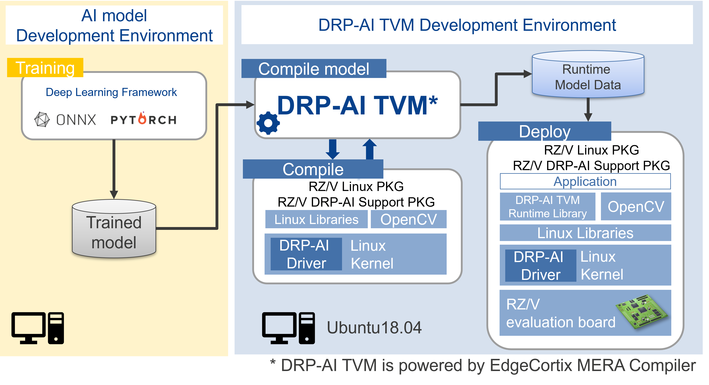

# Extension package of TVM Deep Learning Complier for Renesas DRP-AI accelerators powered by EdgeCortix MERA&trade;

[TVM Documentation](https://tvm.apache.org/docs) |
[TVM Community](https://tvm.apache.org/community) |
[TVM github](https://github.com/apache/tvm) |


DRP-AI TVM[^1] is Machine Learning Compiler plugin for [Apache TVM](https://github.com/apache/tvm/) provided by Renesas Electronics Corporation.

## License
(C) Copyright EdgeCortix, Inc. 2022   
(C) Copyright Renesas Electronics Corporation 2022   
Contributors Licensed under an Apache-2.0 license.   

## Supported Embedded Platforms
- Renesas RZ/V2MA Evaluation Board Kit

## Introduction
### Overview   
This compiler stack is an extension of the DRP-AI Translator to the TVM backend. CPU and DRP-AI can work together for the inference processing of the AI models.  

   


### File Configuration
| Directory | Details |
|:---|:---|
|tutorials |Sample compile script|
|apps |Sample inference application on the target board|
|setup | Setup scripts for building a TVM environment |
|obj |Pre-build runtime binaries|
|tvm | TVM repository from github |
|3rd party | 3rd party tools |   
|how-to |Sample to solve specific problems, i.e., How to run validation between x86 and DRP-AI|


## Installation
### Requirements
Requirements are listed below.  
- OS : Ubuntu 20.04  
- Python : 3.8  
- Package : git
- Evaluation Board: RZ/V2MA EVK
- Related Software Version:
    - [DRP-AI Translator v1.80](#drp-ai-translator)  
    - [RZ/V2MA Linux Package v1.0.0](#rzv-software)  
    - [RZ/V2MA DRP-AI Support Package v7.20](#rzv-software)  

##### DRP-AI Translator
Download the DRP-AI Translator v1.80 from the Software section in [DRP-AI](https://www.renesas.com/application/key-technology/artificial-intelligence/ai-accelerator-drp-ai#software) and install it by following the *User's Manual*.  

##### RZ/V Software
Download the *RZ/V2MA DRP-AI Support Package* from [Renesas Web Page](https://www.renesas.com/products/microcontrollers-microprocessors/rz-mpus/rzv-embedded-ai-mpus#software_amp_tools).  
To use the *DRP-AI Support Package*, *Linux Package* is required.  
*RZ/V2MA Linux Package* can be found in the page of *DRP-AI Support Package*.    

After you donloaded the packages, **build image/SDK** according to the *DRP-AI Support Package Release Note* *1.  

### Installing DRP-AI TVM[^1]  
Before installing DRP-AI TVM[^1], please install the software listed in [Requirements](#requirements) and build image/SDK with RZ/V2MA Linux Package and DRP-AI Support Package.  

#### 1. Clone the respository.   
```sh
git clone --recursive https://github.com/renesas-rz/rzv_drp-ai_tvm.git drp-ai_tvm
```

#### 2. Set environment variables.  
Run the following commands to set environment variables.
Note that environment variables must be set every time when opening the terminal.
```sh
export TVM_HOME=<.../drp-ai_tvm>/tvm                # Your own path to the cloned repository.
export PYTHONPATH=$TVM_HOME/python:${PYTHONPATH}
export SDK=</opt/poky/3.1.14>                       # Your own RZ/V2MA Linux SDK path.
export TRANSLATOR=<.../drp-ai_translator_release/>  # Your own DRP-AI Translator path.
```
#### 3. Install the minimal pre-requisites.   
```sh
# Install packagess
apt update
DEBIAN_FRONTEND=noninteractive apt install -y software-properties-common
add-apt-repository ppa:ubuntu-toolchain-r/test
apt update
DEBIAN_FRONTEND=noninteractive apt install -y build-essential cmake \
libomp-dev libgtest-dev libgoogle-glog-dev libtinfo-dev zlib1g-dev libedit-dev \
libxml2-dev llvm-8-dev g++-9 gcc-9 wget

apt-get install -y python3-pip
pip3 install --upgrade pip
apt-get -y install unzip vim
pip3 install decorator attrs scipy numpy pytest onnx==1.9.0
pip3 install torch==1.8.0 torchvision==0.9.0
```

Installing ONNX Runtime Library from precompiled release package.
```sh
# Install onnx runtime
wget https://github.com/microsoft/onnxruntime/releases/download/v1.8.1/onnxruntime-linux-x64-1.8.1.tgz -O /tmp/onnxruntime.tar.gz
tar -xvzf /tmp/onnxruntime.tar.gz -C /tmp/
mv /tmp/onnxruntime-linux-x64-1.8.1/ /opt/
```
Setup DRP-AI TVM[^1] environment.
```sh
cd <.../drp-ai_tvm>
bash setup/make_drp_env.sh
```

----

## Deploy AI models on DRP-AI
  

To deploy the AI model to DRP-AI on the target board, you need to compile the model with DRP-AI TVM[^1] to generate Runtime Model Data (Compile).  
SDK generated from RZ/V Linux Package and DRP-AI Support Package is required to compile the model.  

After compiled the model, you need to copy the file to the target board (Deploy).  
You also need to copy the C++ inference application and DRP-AI TVM[^1] Runtime Library to run the AI model inference.  

Following pages show the example to compile the ResNet18 model and run it on the target board.  

### Compile model with DRP-AI TVM[^1]
Please see [Tutorial](./tutorials).  

### Run inference on board
Please see [Application Example](./apps) page.  

### How-to
Pages above only show the example for ResNet.  
To find more examples, please see [How-to](./how-to) page.  
It includes the sample to solve specific problems, i.e.;  
- how to run application with camera;  
- validation between x86 and DRP-AI, etc.  

### Error List
If error occurred at compile/runtime operation, please refer [error list](./docs/Error_List.md).

## Support
If you have any questions, please contact [Renesas Technical Support](https://www.renesas.com/support).

----
For any enquiries, please contact Renesas.  

[^1]: DRP-AI TVM is powered by EdgeCortix MERA™ Compiler Framework.
