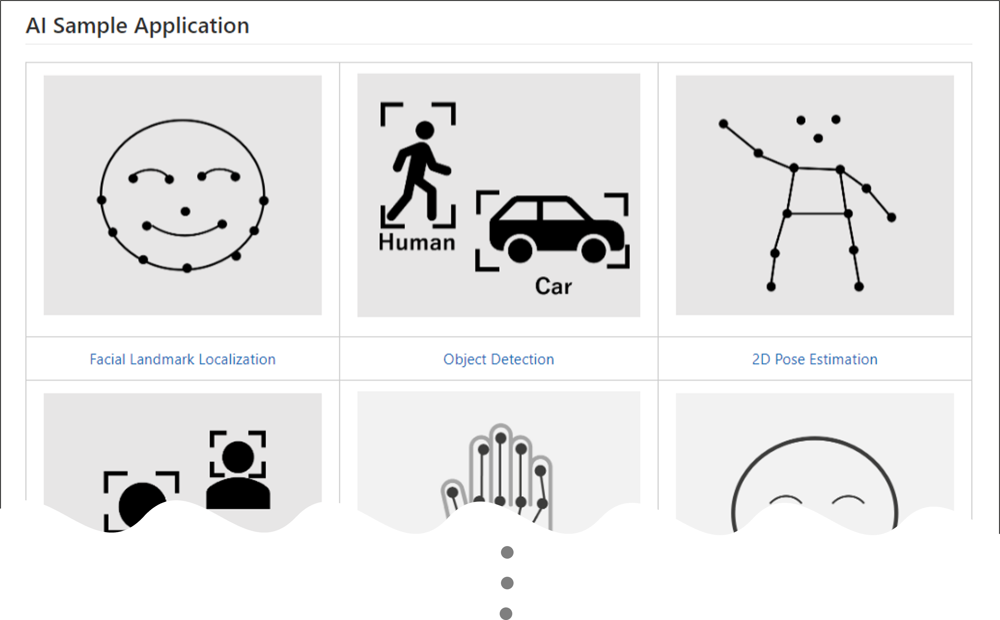

# Extension package of TVM Deep Learning Compiler for Renesas DRP-AI accelerators powered by EdgeCortix MERA&trade; (DRP-AI TVM)

[TVM Documentation](https://tvm.apache.org/docs) |
[TVM Community](https://tvm.apache.org/community) |
[TVM github](https://github.com/apache/tvm) |

[DRP-AI TVM](https://www.renesas.com/application/key-technology/artificial-intelligence/ai-accelerator-drp-ai/ai-tool-drp-ai-tvm) [^1] is Machine Learning Compiler plugin for [Apache TVM](https://github.com/apache/tvm/) with AI accelerator [DRP-AI](https://www.renesas.com/application/key-technology/artificial-intelligence/ai-accelerator-drp-ai) provided by Renesas Electronics Corporation.  

## License
(C) Copyright EdgeCortix, Inc. 2022   
(C) Copyright Renesas Electronics Corporation 2022   
Contributors Licensed under an Apache-2.0 license.   

## Supported Embedded Platforms
- Renesas RZ/V2L Evaluation Board Kit ([How to get](https://www.renesas.com/document/gde/rzv2l-contents-guide))
- Renesas RZ/V2M Evaluation Board Kit ([How to get](https://www.renesas.com/document/gde/rzv2m-contents-guide))
- Renesas RZ/V2MA Evaluation Board Kit ([How to get](https://www.renesas.com/document/gde/rzv2ma-contents-guide))

## Introduction
### Overview   
This compiler stack is an extension of the DRP-AI Translator to the TVM backend. CPU and DRP-AI can work together for the inference processing of the AI models.  

   

### File Configuration
| Directory | Details |
|:---|:---|
|tutorials |Sample compile script|
|apps |Sample inference application on the target board|
|setup | Setup scripts for building a TVM environment |
|obj |Pre-build runtime binaries|
|docs |Documents, i.e., Model list and API list|
|img |Image files used in this document|
|tvm | TVM repository from github |
|3rd party | 3rd party tools |   
|how-to |Sample to solve specific problems, i.e., How to run validation between x86 and DRP-AI|

## Installation
- [Installing DRP-AI TVM](./setup/#installing-drp-ai-tvm1)
- [Installing DRP-AI TVM with Docker](./setup/#installing-drp-ai-tvm1-with-docker)

## Deploy AI models on DRP-AI
### Video
Following video shows brief tutorial for how to deploy ONNX model on RZ/V series board.  
[RZ/V DRP-AI TVM Tutorial - How to Run ONNX Model (YouTube)](https://www.youtube.com/watch?v=IqeZnVBEUxY)

  

### Overview
To deploy the AI model to DRP-AI on the target board, you need to compile the model with DRP-AI TVM[^1] to generate Runtime Model Data (Compile).  
SDK generated from RZ/V Linux Package and DRP-AI Support Package is required to compile the model.  

After compiled the model, you need to copy the file to the target board (Deploy).  
You also need to copy the C++ inference application and DRP-AI TVM[^1] Runtime Library to run the AI model inference.  

   

Following pages show the example to compile the ResNet18 model and run it on the target board.  

### Compile model with DRP-AI TVM[^1]  
Please see [Tutorial](./tutorials).  

### Run inference on board  
Please see [Application Example](./apps) page.  

## Sample Application  
To find more AI examples, please see [How-to](./how-to) page.  

  

## Confirmed AI Model
If you want to know which models have been tested by Renesas, please refer to [Model List](./docs/Model_List.md).

## Support  
### Error List  
If error occurred at compile/runtime operation, please refer [error list](./docs/Error_List.md).  

### Tips  
[How-to](./how-to) page includes following explanation.  
- profilier;  
- validation between x86 and DRP-AI;  
- etc.  

### Enquiries  
If you have any questions, please contact [Renesas Technical Support](https://www.renesas.com/support).  

[^1]: DRP-AI TVM is powered by EdgeCortix MERA™ Compiler Framework.
