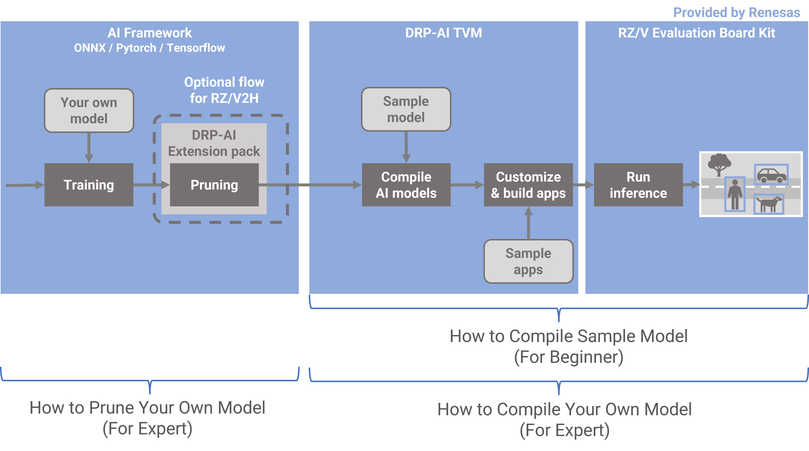
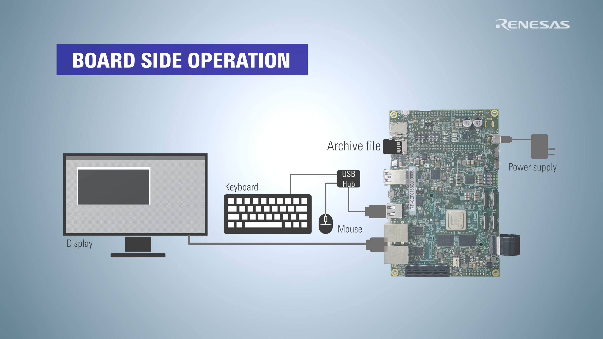

 

There are 3 tutorials about AI deployment tools for RZ/V2H.   
- For easy understanding DRP-AI TVM by using sample model, please follow instructions on this page.
- [For understanding how to prune your own model, please click here](./pruning.html).  
- [For understanding how to compile your own model, please click here](./compile_your_own_model.html).  

 

# Video

  <iframe src="https://players.brightcove.net/5260471205001/default_default/index.html?videoId=6361753634112"
  allowfullscreen
  webkitallowfullscreen
  mozallowfullscreen
  width="80%"
  ></iframe>

 

## Getting Started (RZ/V2H)

### Requirements
Requirements are listed below.

|||
|:------|:---------|
|OS | Ubuntu 20.04|
| Python | 3.8|
| Package | git|
| Container Runtime | Docker |
| Evaluation Board | RZ/V2H EVK|
| Related Software Version | ● DRP-AI TVM v2.3   ● DRP-AI Translator i8 v1.01 : DRP-AI_Translator_i8-v1.01-Linux-x86_64-Install or later.  ● RZ/V2H AI SDK v3.00 : RTK0EF0180F03000SJ.zip or later.   ● DRP-AI Extension Pack (Pruning Tool) v1.00 or later   |

  Note
    Make sure that you have installed <a href="https://docs.docker.com/">Docker</a> on your Linux PC.

  

## Work flow
From this point on, we will follow these steps.  

1. [Setup Environment](#1-setup-environment)  
2. [Compile AI models](#2-compile-AI-models)
3. [Customize & build apps](#3-Customize-&-build-apps)
4. [Run inference](#4-Run-inference)

## 1. Setup Environment

### Preparing a workspace
Prepare a workspace for following steps.  

$ mkdir tvm_work
$ cd tvm_work


### 1-1. Download the required installers
Download DRP-AI Translator i8 v1.01 from below.    
<https://www.renesas.com/software-tool/drp-ai-translator-i8>


$ cp $HOME/Download/r20ut5460ej0101-drp-ai-translator-i8.zip ./
$ unzip r20ut5460ej0101-drp-ai-translator-i8.zip DRP*


Download RZ/V2H AI SDK v3.00 (poky) from below.   
<https://www.renesas.com/us/en/software-tool/rzv2h-ai-software-development-kit>  


$ cp $HOME/Download/RTK0EF0180F03000SJ.zip ./
$ unzip RTK0EF0180F03000SJ.zip */poky*sh
$ mv ai_sdk_setup/* .


### 1-2. Download a dockerfile
Download a Dockerfile from repository.  

$ wget https://raw.githubusercontent.com/renesas-rz/rzv_drp-ai_tvm/main/DockerfileV2H


### 1-3. Build the docker image
Build the docker image which is downloaded in the previous step.  

$ sudo docker build -t drp-ai_tvm_v2h_image --build-arg SDK="/opt/poky/3.1.26" --build-arg PRODUCT="V2H" -f DockerfileV2H .


### 1-4. Create and run a new container from the docker image
Create a container from the docker image built in the previous step.   
You can enter the created container by executing the following command.  

$ sudo docker run -it --name drp-ai_tvm_v2h_container -v $(pwd)/data:/drp-ai_tvm/data drp-ai_tvm_v2h_image


## 2. Compile AI models
All subsequent operations will be performed within the container you have created in Chapter1.  

### 2-1. Download a onnx model
In this case, RESNET50 is used as an example.  
First, download the ONNX model file from the following URL with the following command.  

root@docker_hostname:# cd $TVM_ROOT/tutorials/
root@docker_hostname:# wget https://github.com/onnx/models/raw/main/validated/vision/classification/resnet/model/resnet50-v1-7.onnx


### 2-2. Compile a onnx model
Compile the ONNX format model you have just downloaded with the sample script already prepared.  

root@docker_hostname:# python3 compile_onnx_model_quant.py ./resnet50-v1-7.onnx -o resnet50_v1_onnx -t $SDK -d $TRANSLATOR -c $QUANTIZER --images $TRANSLATOR/../GettingStarted/tutorials/calibrate_sample/ -v 100 


Confirming the output  

root@docker_hostname:# ls resnet50_v1_onnx
deploy.json  deploy.params  deploy.so  input_0.bin  interpreter_out  preprocess


<!--

  Note
If you want to compile pytorch or tensorflow file, reference below.  
 
<a href="">pytorch</a> <a href="">tensorflow</a>  
 
If you want to inference only CPU, reference below.  
 
<a href="">cpu only</a>

-->

## 3. Customize & build apps

### 3-1. Preparing build environment
Prepare an environment for building.  

$ cd $TVM_ROOT/apps
$ mkdir build
$ cd build


$ cmake -DCMAKE_TOOLCHAIN_FILE=./toolchain/runtime.cmake -DV2H=ON ..


### 3-2. Build a sample application
Next, build an application to run the compiled model.  

$ make -j$(nproc)


Confirming the build artifact _tutorial_app_.

$ ls 
CMakeCache.txt  CMakeFiles  Makefile  cmake_install.cmake  tutorial_app


### 3-3. Preparing the necessary files to run on the board
Prepare the necessary files to run on the board.  

$ cd $TVM_ROOT/../
$ mkdir tvm


$ cp $TVM_ROOT/obj/build_runtime/$PRODUCT/libtvm_runtime.so tvm/
$ cp $TVM_ROOT/apps/exe/sample.bmp tvm/
$ cp $TVM_ROOT/apps/exe/ImageNetLabels.txt tvm/
$ cp $TVM_ROOT/apps/exe/synset_words_imagenet.txt tvm/
$ cp $TVM_ROOT/apps/build/tutorial_app* tvm/
$ cp -r $TVM_ROOT/tutorials/resnet50_v1_onnx tvm/

$ tar acvf tvm.tar.gz tvm/


Confirming the _tvm.tar.gz_

$ ls
tvm tvm.tar.gz


## 4. Run inference

### 4-1. Setup the target board
Please refer to the following pages to set up your board.  
First, follow the step on [this page](https://renesas-rz.github.io/rzv_ai_sdk/3.00/getting_started_v2h.html).  
Next, follow only step11 for ip address setting on [this page](https://tool-support.renesas.com/tool-support/Zoo/boot_boad_guide/RZV2H_board_setup_e2studio.html).

### 4-2. Copy to the board
Copy the files you have just prepared to the board.

$ cp ./tvm.tar.gz $TVM_ROOT/data

Exit from container using this command `ctrl + p q`.


$ scp ./data/tvm.tar.gz root@192.168.1.11:/home/root 


## - Board-side operation -
From here, the board is operated.  
Operate the board directly or connect to the board for operation.

### 3-6. Unzip the files
Unzip the files copied to the board.  

root@rzv2h-evk...:# cd /home/root/
root@rzv2h-evk...:# tar xvfz tvm.tar.gz
root@rzv2h-evk...:# cd ./tvm


### 3-7. Run the application
Execute the following command to start the application.  

root@rzv2h-evk...:# export LD_LIBRARY_PATH=.
root@rzv2h-evk...:# cp -r resnet50_v1_onnx resnet18_onnx
root@rzv2h-evk...:# ./tutorial_app


The application runs the ResNet inference on sample.bmp.

Following is the expected output for ResNet50 ONNX model compiled for DRP-AI on RZ/V2H Evaluation Board Kit.



[11:40:41] /drp-ai_tvm/apps/MeraDrpRuntimeWrapper.cpp:73: Loading json data...
[11:40:41] /drp-ai_tvm/apps/MeraDrpRuntimeWrapper.cpp:91: Loading runtime module...
[11:40:42] /drp-ai_tvm/apps/MeraDrpRuntimeWrapper.cpp:96: Loading parameters...
[TIME] PreRuntime DRP-AI processing time : 1.11 msec
[TIME] GetResult() Processing Time : 0.65 msec
[TIME] Pre Processing Time: 2.38 msec.
[11:40:42] /drp-ai_tvm/apps/MeraDrpRuntimeWrapper.cpp:112: Loading input...
Running tvm runtime
[TIME] AI Processing Time: 4.35 msec.
Output data type : FP16.
Result -----------------------
  Top 1 [ 60.6%] : [beagle]
  Top 2 [ 19.4%] : [English foxhound]
  Top 3 [ 15.1%] : [Walker hound, Walker foxhound]
  Top 4 [  2.0%] : [basset, basset hound]
  Top 5 [  0.8%] : [bluetick]



        Note
        To shut down the board safely, please refer to <a href="https://renesas-rz.github.io/rzv_ai_sdk/latest/appendix.html#A4">A4. Shutdown RZ/V2H EVK</a>

**Here is the end of the workflow.**

## Appendix

### Detailed about the files to required to run on the board.

| Name            | Path                                                                                        | Details                                                                                                                                                                   |
|:--------------- |:------------------------------------------------------------------------------------------- |:------------------------------------------------------------------------------------------------------------------------------------------------------------------------- |
| Runtime Library | `drp-ai_tvm/obj/build_runtime/${PRODUCT}/libtvm_runtime.so`                                 | Binary provided under [obj](https://github.com/renesas-rz/rzv_drp-ai_tvm/tree/main/obj/build) directory. You should use the `libtvm_runtime.so` in the directory with the corresponding product name.              |
| Model Data      | `drp-ai_tvm/tutorials/resnet*`                                                              | Model compiled in the [Compile AI models](#2-compile-AI-models). DRP-AI Preprocessing Runtime Object files, (`preprocess` directory) are also included.                           |
| Input Data      | `drp-ai_tvm/apps/exe/sample.bmp`                                                            | Windows Bitmap file, which is input data for image classification.                                                                                                        |
| Label List      | `drp-ai_tvm/apps/exe/synset_words_imagenet.txt` `drp-ai_tvm/apps/exe/ImageNetLabels.txt` | `synset_words_imagenet.txt`:Label list for ResNet18 post-processing. `ImageNetLabels.txt`:Label list for ResNet50 post-processing when compiling Tensorflow Hub model. |
| Application     | `drp-ai_tvm/apps/build/tutorial_app`                                                        | Compiled in this [page](#3-2-build-a-sample-application).                                                                                                                 |
