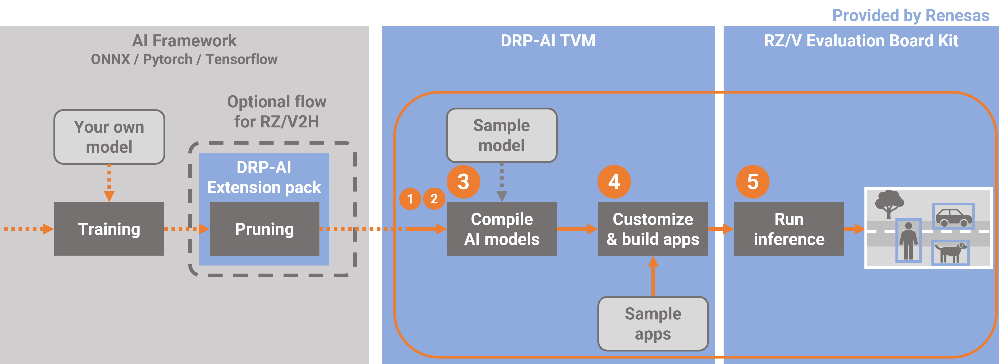
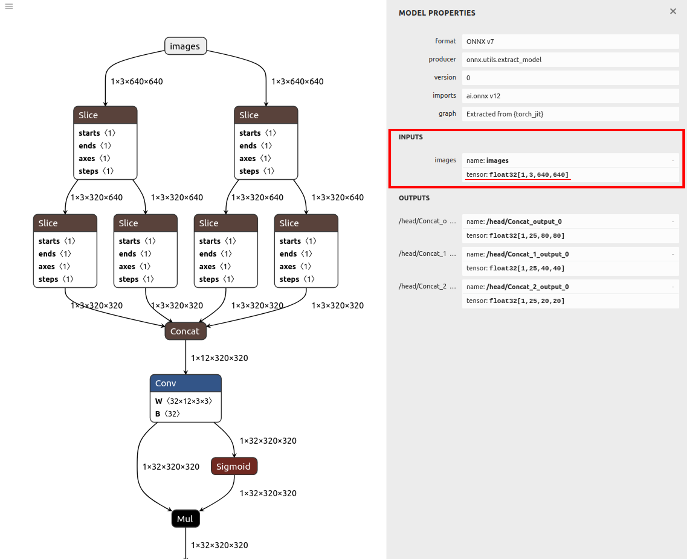
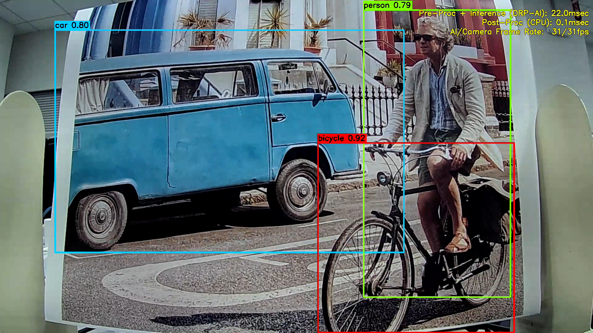

## Compile your own model for RZ/V2H
You can compile your model using a sample script *compile_onnx_model_quant.py*.  
However, since input size and data format of camera and input shape of AI model are different for each application and model, you need to change parameters in the script and some options to compile it.  
Resnet50 was used as a sample model in the "How to Compile Sample Model". In this page, it is explained how to change from Resnet50 to YOLOX as an example.  
Here are some tips applying to your model.  


# Video

<div class="ratio ratio-16x9">
    <iframe src="https://players.brightcove.net/5260471205001/default_default/index.html?videoId=6361753833112"
    allowfullscreen
    webkitallowfullscreen
    mozallowfullscreen></iframe>
</div>

<br>

## Work flow
In explaining how to compile the file, we will first give an overview of the process.  
From this point on, we will follow these steps.  
In this chapter, yolox is used as an example.  



**[1. Confirm the model information](#1-confirm-the-model-information)**  
In order to modify the sample script in the next step, you will need the following information about the model. 

- input format of the model
- input format of the app  

In step1, confirm this information.

**[2. Modify the sample script](#2-modify-the-sample-script)**  
In the sample script, generation for pre-runtime code and quantization is also performed when the model is compiled.  
In order to perform these processes, the sample scripts must also be modified to match the input format of the target model and the input size and format of the application.
Based on the information confirmed in the step1, this step rewrites a part of the sample script.

**[3. Compile the AI model](#3-compile-the-sample-script-with-different-arguments)**  
When executing the sample script on the command line, you can pass the necessary information as an option.  
In compiling the target model, options should be changed accordingly.  
This section describes those options that need to be changed.  

**[4. Build the app](#4-build-the-app)**  
Build an app to run the compiled model.  

**[5. Run on the board](#5-run-on-the-board)**  
Copy the compiled model and the built application to the board for inference.  

## Setup Environment
Please refer to [this page](./compile_sample_model.html) to set up environment before beginning this workflow.  
And from this point on, it is worked in the docker container.

Then, move to working directory, where is _$TVM_ROOT/tutorials_.

root@docker_hostname:# cd $TVM_ROOT/tutorials/


Next, copy the model which you would like to compile to your working directory.  
_`docker cp`_ command is useful to copy files into the docker container.

If you have pruned the yolox model using the DRP-AI Extension Pack on [this page](./pruning.html), you can use the pruned model.  

If you have not pruned the model, you can use the prepared model.  _$TVM_ROOT/how-to/sample_app_v2h/app_yolox_cam/yolox-S_VOC.onnx_

<a id="1-confirm-the-model-information"></a>
## 1. Confirm the model information
First of all, you should find out about the input format of the model and application.  

[Netron](https://netron.app/) is useful to check the model information about the shape of input.    
Also, check the input format of the app from the app source code.  



In the case of yolox, which is the example in this case, the following parameters can be confirmed.  
Input shape of the model：[1,3,640,640]  
Input shape of the app  ：[1920, 1920, 2]  
Input format of the app ：YUYV_422  

<a id="2-modify-the-sample-script"></a>
## 2. Modify the sample script
Next step, you need to modify a preprocess sentences of sample script to fit your model based on the model information which is confirmed in chapter1 because it is necessary to preprocess the input image to match the model input when you will inference using your own model. The sample scripts already contain this preprocess.  

### Calibration   
In the [*compile_onnx_model_quant.py*](https://github.com/renesas-rz/rzv_drp-ai_tvm/blob/main/tutorials/compile_onnx_model_quant.py#L101), the following process is used to utilize the calibration data.(L.101 ～ L.112)  
See [here](https://github.com/renesas-rz/rzv_drp-ai_tvm/blob/main/tutorials/tutorial_RZV2H.md#tips) for more information about calibration .

By changing to the following process, the yolox in this example can be executed.

def pre_process_imagenet_pytorch(img, mean=[0.485, 0.456, 0.406], stdev=[0.229, 0.224, 0.225], dims=None, need_transpose=False):
    
    img = cv2.cvtColor(img, cv2.COLOR_BGR2RGB)
    img = Image.fromarray(img)
-   img = F.resize(img, 256, Image.BILINEAR)
+   img = F.resize(img, 640, Image.BILINEAR)
-   img = F.center_crop(img, 224)
+   img = F.center_crop(img, 640)
-   img = F.to_tensor(img)
+   img = F.pil_to_tensor(img)
-   std = stdev
-   img = F.normalize(img, mean, std, inplace=False)
    if not need_transpose:
        img = img.permute(1, 2, 0) # NHWC
    img = np.asarray(img, dtype='float32')
    return img


For example, you can modify a script like below.


root@docker_hostname:# sed -i -e 's/256/640/g' compile_onnx_model_quant.py #Change resizing the image to 256x256 to 640
root@docker_hostname:# sed -i -e 's/ 224/ 640/g' compile_onnx_model_quant.py #Change Center Cropping parameter 224 to 640
root@docker_hostname:# sed -i -e 's/to_tensor/pil_to_tensor/g' compile_onnx_model_quant.py
root@docker_hostname:# sed -i -e '/std = stdev/d' compile_onnx_model_quant.py #Don't apply normalization
root@docker_hostname:# sed -i -e '/F.normalize/d' compile_onnx_model_quant.py


### pre-runtime 
In the  [*compile_onnx_model_quant.py*](https://github.com/renesas-rz/rzv_drp-ai_tvm/blob/main/tutorials/compile_onnx_model_quant.py#L273), the pre-processing runtime is compiled with the following process（L.273 ~ L.301）  
See [here](https://github.com/renesas-rz/rzv_drp-ai_tvm/blob/main/docs/PreRuntime.md#2412-config) for more information about PreRuntime.

By changing to the following process, the yolox in this example can be executed.

    # 4. Compile pre-processing using DRP-AI Pre-processing Runtime Only for RZ/V2H
    # 4.1. Define the pre-processing data
    config = preruntime.Config()

    # 4.1.1. Define input data of preprocessin
-   config.shape_in     = [1, 480, 640, 3]
+   config.shape_in     = [1, 1920, 1920, 2]
-   config.format_in    = drpai_param.FORMAT.BGR
+   config.format_in    = drpai_param.FORMAT.YUYV_422
    config.order_in     = drpai_param.ORDER.HWC
    config.type_in      = drpai_param.TYPE.UINT8

    # 4.1.2. Define output data of preprocessing (Will be model input)
    model_shape_in = list(opts["input_shape"])
    config.shape_out    = model_shape_in
    config.format_out   = drpai_param.FORMAT.RGB
    config.order_out    = drpai_param.ORDER.CHW
    config.type_out     = drpai_param.TYPE.FP32
    # Note: type_out depends on DRP-AI TVM[*1]. Usually FP32.

    # 4.1.3. Define operators to be run.
    r = 255
-   cof_add = [-m*r for m in mean]
-   cof_mul = [1/(s*r) for s in stdev]
    config.ops = [
        op.Resize(model_shape_in[3], model_shape_in[2], op.Resize.BILINEAR),
        op.Normalize(cof_add, cof_mul)
    ]

    # 4.2. Run DRP-AI Pre-processing Runtime
    preruntime.PreRuntime(config, opts["output_dir"]+"/preprocess", PRODUCT)


For example, you can modify a script like below.


root@docker_hostname:# sed -i -e 's/480, 640, 3/1920, 1920, 2/g' compile_onnx_model_quant.py #change Input image data shape [1, 480, 640, 3] to [1, 1920, 1920, 2]
root@docker_hostname:# sed -i -e 's/FORMAT.BGR/FORMAT.YUYV_422/g' compile_onnx_model_quant.py #chage Input format BGR to YUYV.
root@docker_hostname:# sed -i -e '/cof_add/d' compile_onnx_model_quant.py #Don't apply normalization
root@docker_hostname:# sed -i -e '/cof_mul/d' compile_onnx_model_quant.py


This completes the modification of the sample script.

<a id="3-compile-the-sample-script-with-different-arguments"></a>
## 3. Compile the sample script with different arguments

Using modified sample script in chapter 2, yolox can be compiled by the following command.   


root@docker_hostname:# python3 compile_onnx_model_quant.py \
> $TVM_ROOT/how-to/sample_app_v2h/app_yolox_cam/yolox-S_VOC.onnx \　# target model file to compile
> -o yolox_cam \　# specified a output file name
> -t $SDK \　# path to toolchain
> -d $TRANSLATOR \　# path to DRP-AI Translator
> -c $QUANTIZER \　# path to DRP-AI Quantizer
> -s 1,3,640,640 \　# input shape of the target model
> --images $TRANSLATOR/../GettingStarted/tutorials/calibrate_sample/ \ # Specifies the directory where calibration images are contained
> -v 100


This sample script can optionally specify information needed to compile it.
In this example, the following information is specified

|option|discription|
|:-----|:----------|
|augment |model file|
|-o    |output file name|
|-t    |path to toolchain|
|-d    |path to DRP-AI Translator|
|-c    |path to DRP-AI Quantizer|
|-s    |input shape of the target model|
|-images|Specifies the directory where calibration images are contained|
|-v    |input constant value|

Detailed information on options is provided in [Appendix](#appendix).

<a id="4-build-the-app"></a>
## 4. Build the app

1. Please refer to [Application Example for V2H](https://github.com/renesas-rz/rzv_drp-ai_tvm/blob/main/apps/build_appV2H.md#how-to-build-the-application).  An example of command execution is shown below.


root@docker_hostname:# cd $TVM_ROOT/how-to/sample_app_v2h/app_yolox_cam/src
root@docker_hostname:# mkdir build
root@docker_hostname:# cd build

root@docker_hostname:# cmake -DCMAKE_TOOLCHAIN_FILE=$TVM_ROOT/apps/toolchain/runtime.cmake ..　 
root@docker_hostname:# sed -i -e 's/INPUT_CAM_TYPE 0/INPUT_CAM_TYPE 1/g' ../define.h  # 0 for USB cam, 1 for MIPI cam to build
root@docker_hostname:# make


2. The `sample_app_drpai_tvm_yolox_cam` application binary is generated.

<a id="5-run-on-the-board"></a>
## 5. Run on the board

### 5-1. Preparing the necessary files to run on the board
Prepare the necessary files to run on the board.  

$ cd $TVM_ROOT/../
$ rm -r sample_app ; mkdir sample_app
$ cp $TVM_ROOT/obj/build_runtime/V2H/libtvm_runtime.so sample_app/
$ cp $TVM_ROOT/how-to/sample_app_v2h/app_yolox_cam/src/build/sample_app_drpai_tvm_yolox_cam sample_app/
$ cp -r $TVM_ROOT/tutorials/yolox_cam sample_app/
$ tar cvfz sample.tar.gz sample_app/
$ cp sample.tar.gz $TVM_ROOT/data/


### 5-2. Connecting Camera and Display
After setup your board refering to [here](./compile_sample_model.html#4-Run-inference), please connect cammera and display refering to [this page](https://github.com/renesas-rz/rzv_drp-ai_tvm/blob/main/how-to/sample_app_v2h/app_yolox_cam/README.md#1-connecting-camera-and-display).

### **(On RZ/V Board)** Copy and Try it  

For example, as follows.

root@rzv2h-evk...:# cd /home/root/
root@rzv2h-evk...:# scp <yourhost>:<homedirectory>/data/sample.tar.gz .
root@rzv2h-evk...:# tar xvfz sample.tar.gz 
root@rzv2h-evk...:# cd sample_app/
root@rzv2h-evk...:# export LD_LIBRARY_PATH=.
root@rzv2h-evk...:# ./sample_app_drpai_tvm_yolox_cam


Following window shows up on HDMI screen



On application window, following information is displayed.

- Camera capture
- Object Detection result (Bounding boxes, class name and score.)  
- Processing times
  - Pre-Proc + Inference (DRP-AI): Processing time taken for AI inference and its pre/post-processes on DRP-AI. [msec]
  - Post-Proc (CPU): Processing time taken for post-processes of AI inference on CPU. [msec]
  - AI/Camera Frame Rate: The number of AI inferences per second and the number of Camera captures per second. [fps]

To terminate the application, press `Enter` key on the Linux console terminal of RZ/V2H Evaluation Board Kit.

The `<timestamp>_app_yolox_cam.log` file is to be generated under the `logs` folder and is to be recorded the text logs of AI inference results and AI processing time and rate.

```txt
[XXXX-XX-XX XX:XX:XX.XXX] [logger] [info] ************************************************
[XXXX-XX-XX XX:XX:XX.XXX] [logger] [info]   RZ/V2H DRP-AI Sample Application
[XXXX-XX-XX XX:XX:XX.XXX] [logger] [info]   Model : Megvii-Base Detection YOLOX | yolox_cam
[XXXX-XX-XX XX:XX:XX.XXX] [logger] [info]   Input : MIPI Camera
[XXXX-XX-XX XX:XX:XX.XXX] [logger] [info] ************************************************
[XXXX-XX-XX XX:XX:XX.XXX] [logger] [info] [START] Start DRP-AI inference...
[XXXX-XX-XX XX:XX:XX.XXX] [logger] [info] Inference ----------- No. 1
[XXXX-XX-XX XX:XX:XX.XXX] [logger] [info]  Bounding Box Number : 4
[XXXX-XX-XX XX:XX:XX.XXX] [logger] [info]  Bounding Box        : (X, Y, W, H) = (457, 245, 208, 427)
[XXXX-XX-XX XX:XX:XX.XXX] [logger] [info]  Detected Class      : person (Class 14)
[XXXX-XX-XX XX:XX:XX.XXX] [logger] [info]  Probability         : 89.1 %
[XXXX-XX-XX XX:XX:XX.XXX] [logger] [info]  Bounding Box Number : 7
[XXXX-XX-XX XX:XX:XX.XXX] [logger] [info]  Bounding Box        : (X, Y, W, H) = (457, 354, 297, 250)
[XXXX-XX-XX XX:XX:XX.XXX] [logger] [info]  Detected Class      : bicycle (Class 1)
[XXXX-XX-XX XX:XX:XX.XXX] [logger] [info]  Probability         : 90.9 %
[XXXX-XX-XX XX:XX:XX.XXX] [logger] [info]  Bounding Box Number : 10
[XXXX-XX-XX XX:XX:XX.XXX] [logger] [info]  Bounding Box        : (X, Y, W, H) = (181, 214, 388, 441)
[XXXX-XX-XX XX:XX:XX.XXX] [logger] [info]  Detected Class      : bus (Class 5)
[XXXX-XX-XX XX:XX:XX.XXX] [logger] [info]  Probability         : 50.5 %
[XXXX-XX-XX XX:XX:XX.XXX] [logger] [info]  bounding box Count  : 3
[XXXX-XX-XX XX:XX:XX.XXX] [logger] [info] Pre-Proc + Inference (DRP-AI): XX.X [ms]
[XXXX-XX-XX XX:XX:XX.XXX] [logger] [info] Post-Proc (CPU): X.X [ms]
[XXXX-XX-XX XX:XX:XX.XXX] [logger] [info] AI Frame Rate XX [fps]
[XXXX-XX-XX XX:XX:XX.XXX] [logger] [info] [START] Start DRP-AI inference...
[XXXX-XX-XX XX:XX:XX.XXX] [logger] [info] Inference ----------- No. 2
```

**Here is the end of the workflow.**
# Appendix

## options

|option|discription|example|
|:------|:---------|:------|
|-o, --output_dir|Output directory to save compile results.|-o DIR_NAME|
|-t, --toolchain_dir|Cross-compilation toolchain root directory|-t DIR_NAME|
|-d, --drp_compiler_dir|DRP-AI Translator root directory|-d DIR_NAME|
|-v, --drp_compiler_version, |DRP-AI Translator version (091 or 100)|-v 100|
|-c, --quantization_tool|Quantization tool directory|-c DIR_NAME|
|-s, --input_shape, |AI model input node shape|-s 1,3,224,224|
|-i, --input_name|AI model input node name. (Not required for pytorch models)|-i DIR_NAME|
|-n, --num_frame (default=1)|number of images to use for calibration|-n 10|
|--images|Specifies the directory where calibration images are contained|--images DIR_NAME|
|-r, --record_dir|Calibration data record directory|-r DIR_NAME|
|--level (default=1)|Optimization level at compile. "1" is the default and compiles with optimal settings. If "0" is set to this option, complex models can be deployed, but inference speed is slower.|--level 0|
|-q, --fp16|Convert to FP16|-q|
|-f, --cpu_data_type (default="float16")|Specify cpu data type (float16/float32)|-f float16|
|-p, --quantization_option (default="")|drpai quantization option|-p \"-az\"|


For example, you can compile your model using the sample script with the some options like below.


# python3 compile_onnx_model_quant.py \
>   ./resnet50-v1-7.onnx \
>   -o resnet50_v1_onnx \
>   -t $SDK \
>   -d $TRANSLATOR \
>   -c $QUANTIZER \
>   --images $TRANSLATOR/../GettingStarted/tutorials/calibrate_sample/ \
>   -v 100 




