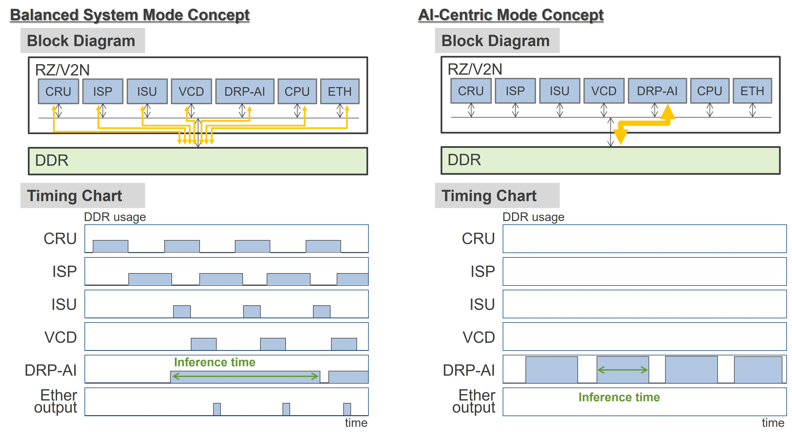

# Model list for RZ/V2N

---

Below is a list of AI models that Renesas has verified for conversion with the RUHMI[^1] and actual operation on an evaluation board.

| Item                       | RZ/V2N              |
| -------------------------- | ------------------- |
| RUHMI[^1] AI compiler      | R2026-06            |
| Evaluation Board           | RZ/V2N EVK          |
| DRP-AI Translator i8       | v1.12               |
| RZ/V2N AI SDK              | v6.30               |

## V2N measurement conditions   

The V2N measurement was performed under the following two conditions:   

1. :balance_scale: **Balanced System Mode (Default)**   
**Balanced System Mode** constrains the bus bandwidth between the DRP-AI and DRAM to preserve the performance (FPS and transfer rate) of non-AI functions such as camera and codec processing. This mode is the default configuration of the [RZ/V2N AI SDK](https://renesas-rz.github.io/rzv_ai_sdk/latest/howto_build_aisdk_v2n.html).    

2. :rocket: **AI-Centric mode**   
**AI-Centric mode** allows full bus bandwidth between the DRP-AI and DRAM without limitation.    
See this [RZ/V2N AI-SDK](https://renesas-rz.github.io/rzv_ai_sdk/latest/howto_build_aisdk_v2n.html) guide for setup instructions about bus setting patch.    

## **Representative models**

| AI model | Input Shape |  :balance_scale: &nbsp;Balanced&nbsp;System Inferences/s | :balance_scale: &nbsp;Balanced&nbsp;System Inference&nbsp;time(ms) |:rocket: &nbsp;AI-Centric  Inferences/s | :rocket: &nbsp;AI-Centric Inference&nbsp;time(ms)  | Task | Params (M) |
| :-- | --: | --: | --: | --: | --: | :-- | --: |
|[YOLOv5s](./how_to_convert/How_to_convert_yolov5_onnx_models.md)|640,640|23.3|43.0|48.3|20.7|Object Detection|7.3|
|[YOLOv5m](./how_to_convert/How_to_convert_yolov5_onnx_models.md)|640,640|12.5|79.8|27.6|36.2|Object Detection|21.4|
|[YOLOv8n](./how_to_convert/How_to_convert_yolov8_onnx_models.md)|640,640|33.0|30.3|64.4|15.5|Object Detection|3.1|
|[YOLOv8s](./how_to_convert/How_to_convert_yolov8_onnx_models.md)|640,640|18.0|55.7|44.0|22.7|Object Detection|11.2|
|[YOLOv8m](./how_to_convert/How_to_convert_yolov8_onnx_models.md)|640,640|8.6|116.2|21.1|47.4|Object Detection|25.9|
|[YOLO11n](./how_to_convert/How_to_convert_yolov11_onnx_models.md)|640,640|29.0|34.5|60.5|16.5|Object Detection|2.6|
|[YOLO11s](./how_to_convert/How_to_convert_yolov11_onnx_models.md)|640,640|15.1|66.3|41.0|24.4|Object Detection|9.4|
|[YOLO11m](./how_to_convert/How_to_convert_yolov11_onnx_models.md)|640,640|4.3|233.2|21.7|46.0|Object Detection|20.1|
|[YOLOX_s](./how_to_convert/How_to_convert_yolox_onnx_models.md)|640,640|23.3|42.9|52.1|19.2|Object Detection|9.0|
|[YOLOX_m](./how_to_convert/How_to_convert_yolox_onnx_models.md)|640,640|11.1|90.2|24.0|41.7|Object Detection|25.3|
|[MobileNetV2](./how_to_convert/How_to_download_ONNX_models.md)|224,224|689.7|1.4|699.3|1.4|Classification|3.5|
|[ResNet50-v1](./how_to_convert/How_to_download_ONNX_models.md)|224,224|204.9|4.9|205.8|4.9|Classification|25.6|
|[HRNet](./how_to_convert/How_to_convert_hrnet_onnx_model.md)|256,192|51.1|19.6|96.1|10.4|Pose Estimation|28.5|
|[YOLOv8n-pose](./how_to_convert/How_to_convert_yolov8pose_onnx_models.md)|640,640|33.1|30.2|66.2|15.1|Multi Person Pose Estimation|3.3|
|[YOLOv8s-pose](./how_to_convert/How_to_convert_yolov8pose_onnx_models.md)|640,640|17.7|56.4|43.4|23.1|Multi Person Pose Estimation|11.6|
|[YOLOv8m-pose](./how_to_convert/How_to_convert_yolov8pose_onnx_models.md)|640,640|8.5|117.7|20.9|47.8|Multi Person Pose Estimation|26.4|
|[face_landmark](./how_to_convert/How_to_download_ONNX_models.md)|192,192|343.6|2.9|595.2|1.7|Face Landmark Detection|0.6|
|[hand_landmark](./how_to_convert/How_to_download_ONNX_models.md)|256,256|143.1|7.0|320.5|3.1|Hand Landmark Detection|2.0|
|[MiDaS v2.1 Small](./how_to_convert/How_to_convert_MiDaS_onnx_models.md)|256,256|58.0|17.2|108.8|9.2|Depth Estimation|16.6|

:information_source:　The evaluation of this model list was performed by extending the DRP-AI memory area.
Please refer to the [guide](https://github.com/renesas-rz/rzv_drp-ai_tvm/blob/main/docs/model_list/how_to_expand_drpai_memory.md) for instructions on how to extend the DRP-AI memory area.

----   

[^1]: RUHMI Framework is powered by EdgeCortix MERA&trade;.