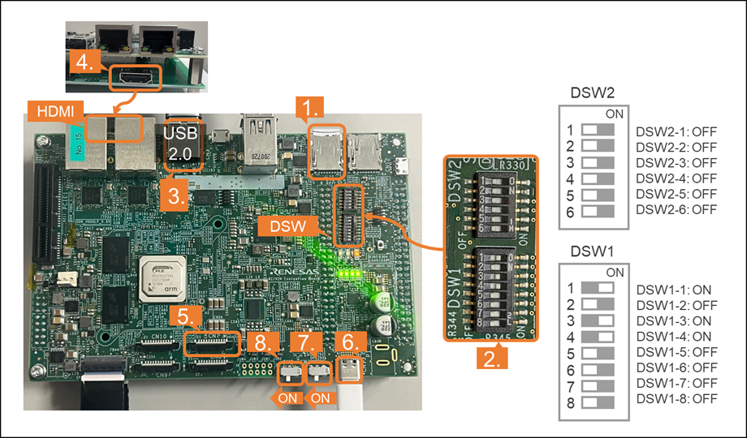

# 1. Overview

This package is a demo system which can confirm the performances of AI models on RZ/V2H Evaluation Board Kit.

This package supports the following AI models.

* YOLOX-S
* DeepLabv3
* HRNet
* ResNet50

Users can select the AI model applications on the GUI menu by using the USB mouse, without typing any command.

# 2. Package Contents


rzv2h_ai_performance_demo_sd_image.wic.gz	: SD Card Image file (WIC format)
licenses.zip					: License files for the software   
					          composing this SD Card Image. 


# 3. Required Hardware

## 3.1 Target board and peripheral equipment

| Item                                      | Note                                                         |
| ----------------------------------------- | ------------------------------------------------------------ |
| RZ/V2H Evaluation Board Kit               | Hereinafter referred to as the "RZ/V2H EVK"                  |
| USB PD (100W) + USB Type-C cable          |                                                              |
| micro SD Card                             | **Required 8GB or more of the capacity.** This package is tested by using SDHC microSD 16GB. |
| MIPI camera (e-con Systems e-CAM22_CURZH) |                                                              |
| HDMI monitor + HDMI cable                 |                                                              |
| USB mouse                                 |                                                              |

## 3.2 PC for writing SD Card image

| Item                 | Note                                                         |
| -------------------- | ------------------------------------------------------------ |
| Linux PC             | This package is tested on the Linux PC with Ubuntu OS 20.04. |
| micro SD card reader | Required if the Linux PC does NOT equips any micro SD card reader. |

# 4. How to use this package

## 4.1. How to write the SD Card Image into the SD Card

1. Copy the following files into any directory on the Linux PC.
   * `rzv2h_ai_performance_demo_sd_image.wic.gz`
2. Execute the following command to install `bmap-tools` into the Linux PC. (If already installed, this step can be skipped.)


$ sudo apt install bmap-tools


3. Insert the micro SD Card into the micro SD Card reader, and connect the micro SD Card reader to the Linux PC.
4. Execute `lsblk` command, and confirm the Confirm the device file name of the micro SD Card and the size of it.
   * In this example below, the device file name of the micro SD Card is `sda` listed on the  `NAME` column.


$ lsblk
NAME        MAJ:MIN RM   SIZE RO TYPE MOUNTPOINT
:
sda           8:0    1  14.2G  0 disk 
├─sda1        8:1    1  16.9M  0 part 
└─sda2        8:2    1     4G  0 part /mnt/sd
:


* If any partition of the micro SD card is mounted on the Linux PC filesystem, please unmount all partition.
  * In the example above, the `sda2` partition of the micro SD card is mounted on `/mnt/sd` on the Linux PC file system. You can unmount the partition by executing the following command.


$ sudo umount /dev/sda2
or
$ sudo umount /mnt/sd


5. Write the SD Card image files (`rzv2h_ai_performance_demo_sd_image.wic.gz`) into the micro SD card by the following command.
   * The command below write the SD Card image to the `sda` device file. 
     Please replace `sda` with a device file name displayed on your Linux PC by  `lsblk` command. 


$ sudo bmaptool copy --nobmap rzv2h_ai_performance_demo_sd_image.wic.gz /dev/sda


> **Note: It will take approximately 5 minutes to write the image file to the SD card.**

## 4.2 How to configure RZ/V2H EVK

First, please prepare RZ/V2H EVK.

* RZ/V2H EVK is composed of CPU Board and EXP Board. 
  Please assembly the RZ/V2H EVK according to the RZ/V2H EVK Hardware Manual in the link below.
  * [RZ/V2H Evaluation Board Kit Hardware Manual](https://www.renesas.com/us/en/document/mah/rzv2h-evaluation-board-kit-secure-type-hardware-manual?r=25471796)

Next, please configure the RZ/V2H EVK and connects the peripheral equipment to it in the order according to the figure below.

1. Insert the micro SD Card to the RZ/V2H EVK.
2. Configure the DSW1 and DSW2 according the figure above.
3. Connect the USB Mouse to the USB 2.0 terminal on RZ/V2H EVK.
4. Connect the HDMI monitor to the RZ/V2H EVK with HDMI cable.
5. Connect the MIPI camera to the RZ/V2H EVK.
   * Regarding how to connect the MIPI camera, please refer to the following link and the "Run the application" section in the link.
     * [https://github.com/renesas-rz/rzv_drp-ai_tvm/tree/main/how-to/sample_app_v2h/app_yolox_cam#1-connecting-camera-and-display](https://github.com/renesas-rz/rzv_drp-ai_tvm/tree/main/how-to/sample_app_v2h/app_yolox_cam#1-connecting-camera-and-display)
6. Connect the USB PD 100W to the RZ/V2H EVK with USB Type-C cable.
7. Turn the SW3 to ON.
8. Turn the SW2 to ON to power on the RZ/V2H EVK.

Finally, after waiting for about 10 seconds, GUI menu will be displayed on the HDMI monitor.

## 4.3 How to start the AI applications on the GUI menu

Users can select and start the AI model applications on the GUI menu by using the USB mouse without typing command.

1. Click on the [Start] button of any AI model application to run it, then the AI model application result will be displayed.
   * The processing times of AI model the user selected will be displayed at the upper right corner.

2. If user clicks to the blue (x) icon at the lower right corner, the application will finish. 
   * The GUI menu will be displayed again, and user can will select the next AI model application on the GUI menu.

## 4.4 How to shut down the GUI menu and the RZ/V2H EVK

1. Clicks to the [x] icon at the upper right corner on the GUI menu, then the software will shut down and the following log will be displayed.


[xxxxx.xxxxxx] reboot: Power down


2. Turn the SW2 to OFF.

3. Turn the SW3 to OFF.

# 5. Version History

* v0.50 issued on 10th May 2024. 
* v1.00 issued on 26th June 2024. 

