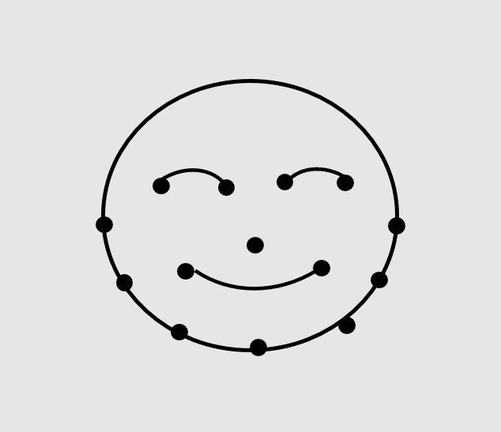
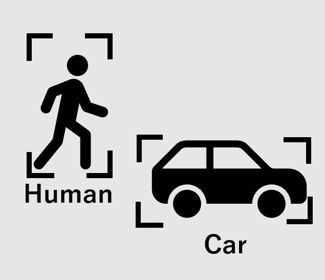
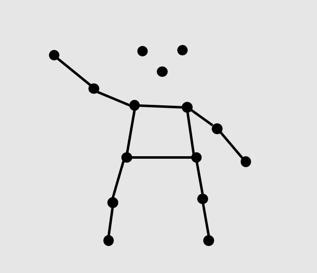
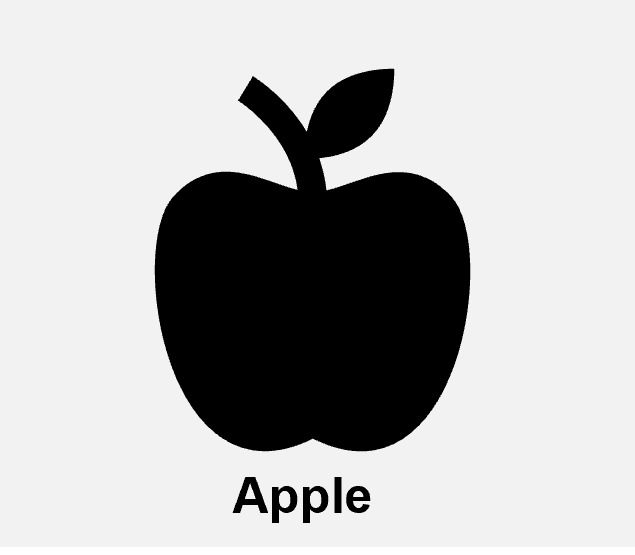
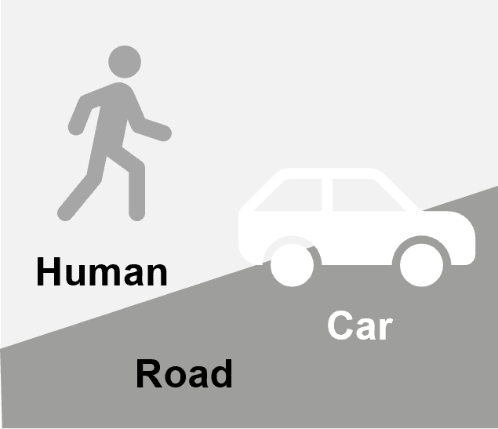
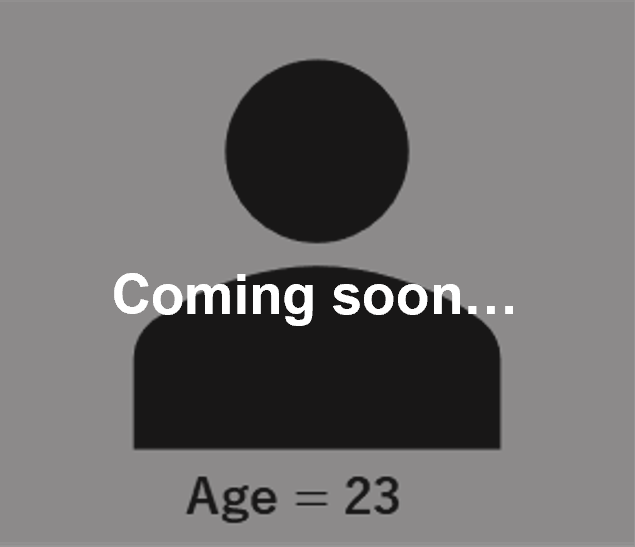

# How to solve specific problems

This directory contains the solution to specific problems related to DRP-AI TVM[^1].  

## Index
- [How to solve specific problems](#how-to-solve-specific-problems)
  - [Index](#index)
  - [AI Sample Application](#ai-sample-application)
  - [Tips](#tips)

## AI Sample Application
<table>
<tr>
    <td align="center"></td>
    <td align="center"></td>
    <td align="center"></td>
</tr>
<tr>
    <td align="center"><a href="sample_app/docs/face_landmark_localization/deeppose">Facial Landmark Localization</a></td>
    <td align="center"><a href="sample_app/docs/object_detection/yolo">Object Detection</a></td>
    <td align="center"><a href="sample_app/docs/human_pose_estimation/hrnet">2D Pose Estimation</a></td>
</tr>
<tr>
    <td align="center"></td>
    <td align="center"></td>
    <td align="center"></td>
</tr>
<tr>
    <td align="center"><a href="sample_app/docs/face_detection/ultraface">Face Detection</a></td>
    <td align="center"><a href="sample_app/docs/hand_landmark_localization/hrnetv2">Hand Landmark Localization</a></td>
    <td align="center"><a href="sample_app/docs/emotion_recognition/emotion_ferplus">Emotion Recognition</a></td>
</tr>
<tr>
    <td align="center"></td>
    <td align="center"></td>
    <td align="center"></td>
</tr>
<tr>
    <td align="center"><a href="sample_app/docs/classification/googlenet">Classification</a></td>
    <td align="center"><a href="sample_app/docs/semantic_segmentation/deeplabv3">Semantic Segmentation</a></td>
    <td align="center">Age Classification </td>
</tr>
</table>

## Tips
- [How to read compile log](tips/how-to-read-log.md)
- [How to compare CPU vs DRP-AI TVM accuracy differences for ONNX model](tips/compare_difference)
- [How to obtain profiling data](tips/profiling)

---
[^1]: DRP-AI TVM is powered by EdgeCortix MERA™ Compiler Framework.
