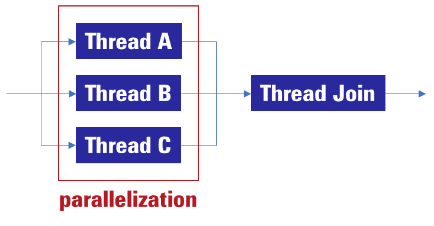

# Post-Processing Optimization Guide

## Index

 1. [Introduction](#1-introduction)
 1. [A general-purpose post-processing optimization method](#2-a-general-purpose-post-processing-optimization-method)<br>
    2.1 [Compiler optimization options](#21-compiler-optimization-options)<br>
    2.2 [Parallel processing using multithreading](#22-parallel-processing-using-multithreading)<br>
    2.3 [Optimization of cache utilization efficiency](#23-optimization-of-cache-utilization-efficiency)
 1. [Example of model-specific post-processing optimization method](#3-example-of-model-specific-post-processing-optimization-method)<br>
    3.1 [A method applicable to YOLOX and similar models](#31-a-method-applicable-to-yolox-and-similar-models)  

## 1. Introduction

This document is intended for AI application developers who are using [AI SDK](https://renesas-rz.github.io/rzv_ai_sdk/latest/) in combination with RZ/V2L, RZ/V2H and RZ/V2N.

The RZ/V series MPU is equipped with an AI accelerator named DRP-AI.
This accelerator can be utilized for pre-processing and AI inference tasks, delivering significantly faster performance compared to CPU-only processing.
However, the accelerator does not support post-processing operations, which must be executed exclusively by the CPU (Figure 1).

<div align="center">
  
  <br>
  <em>Figure 1: Process flow in RZ/V2L, RZ/V2H and RZ/V2N</em>
</div>
<br>

If the post-processing time is significantly longer than the AI inference time, it can offset the performance gains provided by the accelerator.
Therefore, optimizing the post-processing workflow is essential to improving overall processing efficiency. This document provides comprehensive guidance on post-processing techniques.

## 2. A general-purpose post-processing optimization method

### 2.1 Compiler optimization options

In the development environment for RZ/V series MPU, GCC is used as the compiler.
Compiler optimization options refer to settings applied during the compilation process
that enable the compiler to automatically improve the code with the goal of enhancing execution speed, reducing memory usage, and improving overall performance.

To accelerate processing on the CPU, the use of the compiler option -O3 is recommended.
Compiler optimization options are specified in the **CMakeLists.txt** file.
For example, in [the YOLOX application](https://github.com/renesas-rz/rzv_drp-ai_tvm/tree/v2.6.0/how-to/sample_app_v2h/app_yolox_cam), the following options are defined in the CMakeLists.txt file located in the src directory.

```
target_compile_options(${EXE_NAME} PRIVATE -O3 -mtune=cortex-a55 -Wall)
```

For details on compiler optimization options, please refer to [the official web page](https://gcc.gnu.org/onlinedocs/gcc/Optimize-Options.html).
When applying these options, users are responsible for evaluating their impact on accuracy and other factors.

### 2.2 Parallel processing using multithreading

The RZ/V2L integrates two Cortex-A55 CPU cores, while the RZ/V2H and the RZ/V2N incorporate four Cortex-A55 CPU cores. If sufficient CPU resources are available, parallelization through multithreading may be considered.

In practice, the following steps are performed.

1. Identify portions of the post-processing stage that are free from data dependencies and suitable for parallel execution.
1. Determine the optimal number of segments into which the workload can be divided.
1. Create threads corresponding to each of the divisible tasks.
1. Wait for all threads to finish processing, then aggregate the results.

<div align="center">
  
  <br>
  <em>Figure 2: Schematic illustration of parallel processing</em>
</div>
<br>

To achieve efficient parallel processing, the following conditions are critical:

+ There should be no dependencies on data being processed by other threads.
+ Potential impacts on other threads must be considered to avoid CPU resource contention.
+ Tasks should be parallelized in units with as uniform a workload as possible.

The following is a basic C++ code example corresponding to the red-framed section in Figure 2.

```cpp
    // please include this file.
    #include <thread>
 ```

 ```cpp
    // Create three threads. 
    std::thread thread_A(function1, arguments of function1);
    std::thread thread_B(function2, arguments of function2);
    std::thread thread_C(function3, arguments of function3);

    // Wait for thread completion.
    thread_A.join();
    thread_B.join();
    thread_C.join();
```

When applying this method, it is essential to carefully consider the balance of parallel processing and the potential impact on other threads.
Failure to do so may result in suboptimal performance improvements and compromise the stability of the application.
Users are responsible for thoroughly evaluating the method before applying it to their products.

### 2.3 Optimization of cache utilization efficiency

This section demonstrates that, in some cases, post-processing can be accelerated by reordering AI inference output data—for example, by transposing from CHW format to HWC format.

In general, when data accessed sequentially is also arranged contiguously in memory, cache memory can be utilized more effectively, resulting in faster data access.
To take advantage of this characteristic, additional processing is required-either by reordering the data access sequence to match the memory placement of the data,
or by rearranging the data placement in memory to align with the access pattern.
If the overhead introduced by this additional processing is smaller than the performance gain achieved through improved memory access, overall processing time can be reduced.

As an example, this document describes how this technique is applied in the post-processing stage of [the TopFormer application](https://github.com/renesas-rz/rzv_drp-ai_tvm/tree/v2.6.0/how-to/sample_app_v2h/app_topformer_cam).

The output of AI inference in the TopFormer is in CHW format with a shape of [150, 64, 64],
where the data is arranged with priority along the width dimension.

<div align="center">
  
  <br>
  <em>Figure 3: Tensor in CHW format. Only the index corresponding to the width dimension (W) is shown; indices for the channel (C) and height (H) dimensions are omitted for brevity.</em>
</div>
<br>

In the post-processing of the Topformer, it is necessary to determine,
at each spatial location of the image, the class with the highest class score.
When this operation is performed on the above tensor,
it involves sequentially accessing data that are located at distant memory addresses in order to compute the maximum value.
For example, to determine the class with the highest class score at the spatial location (height = 1, width = 1),
it is necessary to access the data highlighted in yellow.

To address this, a transpose operation is applied to convert the data layout to HWC format (with shape [64, 64, 150]),
in which the data is arranged with priority given to the channel (C) dimension.

<div align="center">
  
  <br>
  <em>Figure 4: Tensor in HWC format. Only the index corresponding to the channel (C) is shown; indices for the width (W) and height (H) dimensions are omitted for brevity.</em>
</div>
<br>

By using this tensor, it is possible to sequentially access data that are stored in contiguous memory locations
to determine the class with the highest class score.
For example, to identify the class with the highest score at the spatial location (height = 1, width = 1),
the data highlighted in yellow must be accessed.
As a result, improved cache utilization leads to reduced processing time.

For the source code, please refer to R_Post_Proc_TopFormer in main_topformer.cpp located in the src directory of [the Topformer application](https://github.com/renesas-rz/rzv_drp-ai_tvm/tree/v2.6.0/how-to/sample_app_v2h/app_topformer_cam).

This method involves a certain overhead due to the transpose operation.
Depending on the model, the cost of transposition may outweigh its benefits, resulting in no reduction in processing time.
For example, in the case of [Deeplabv3](https://github.com/renesas-rz/rzv_drp-ai_tvm/tree/v2.6.0/how-to/sample_app_v2h/app_deeplabv3_cam) (output data size: height 513 × width 513 × 20 classes),
no processing time improvement was observed.

In general, the data layout of AI model outputs depends on the model being used.
If a model can be prepared that outputs data in a class-score-prioritized format,
the overhead of transposition can be avoided, allowing the benefits of this method to be fully realized.

## 3. Example of model-specific post-processing optimization method

### 3.1 A method applicable to YOLOX and similar models

This section introduces optimization techniques for reducing the number of computations required to obtain reliable bounding boxes in YOLOX and similar models.

In the AI inference process of YOLOX, the input image is divided into three grids of different sizes,
resulting in a total of 8,400 grid cells (20×20 + 40×40 + 80×80).
For each grid cell, inference is performed to obtain both object detection and classification results.
The object detection result includes information for a single bounding box:
the predicted center coordinates (x, y), the predicted width and height (w, h), and the objectness score (c).
The classification result provides the probability values for each of the C classification categories,
denoted as p₁, p₂, ..., p<sub>c</sub> .

In the post-processing stage, the following steps are performed using the inference results.

1. To determine the class detected by each bounding box, the highest probability value p<sub>n_max</sub> ( where 1 ≤ n_max ≤ C ) is identified.
1. The product c × p<sub>n_max</sub> is calculated.
1. Using a predefined threshold T, the condition c × p<sub>n_max</sub> >T is evaluated to select a set of plausible bounding boxes.
1. Coordinate transformation is applied to the bounding boxes remaining after step 3.
1. Non-Maximum Suppression (NMS) is performed to eliminate redundant bounding boxes.

This section describes a method for reducing the number of computations required in steps 1, 2, and 3.

To perform these steps efficiently, the following approach is used:
Considering that 0 < p<sub>n_max</sub> ≤ 1,
any bounding box that satisfies c × p<sub>n_max</sub> > T must also satisfy c > T.
Therefore, bounding boxes that satisfy the condition c > T are first selected.
By applying steps 1, 2, and 3 only to the selected bounding boxes, the number of computations required in these steps can be effectively reduced (Figure 5). In the process after optimizaion, additional operations are required; however, the computationally intensive task of calculating  p<sub>n_max</sub> can be reduced, resulting in an overall improvement in processing speed.

<div align="center">
  
  <br>
  <em>Figure 5: Computation Procedure (a) before optimization (left), (b) after optimization (right). The shaded areas represent sets of bounding boxes subject to computation.</em>
</div>
<br>

For the source code, please refer to R_Post_Proc in the main_yolox.cpp file located in the src directory of [the YOLOX application](https://github.com/renesas-rz/rzv_drp-ai_tvm/tree/v2.6.0/how-to/sample_app_v2h/app_yolox_cam).
This post-processing method has been verified to be applicable to both YOLOv5 and YOLOv7.
