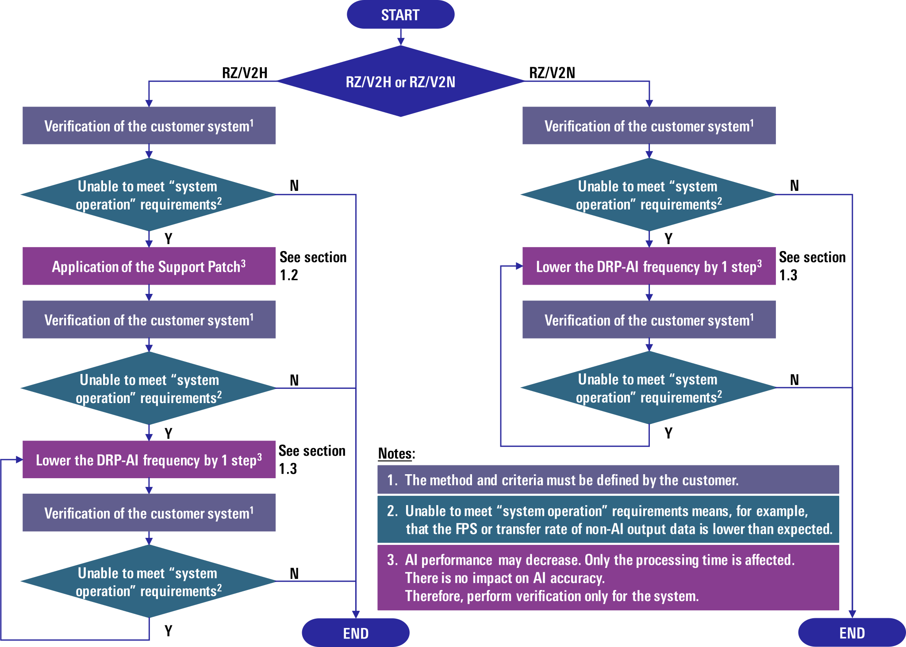

# System Stabilization Guide

## Index
 1. [System stabilization procedure](#1-system-stabilization-procedure)<br>
 1.1 [System stabilization flow](#11-system-stabilization-flow)<br>
 1.2 [How to apply the support patch for RZ/V2H users](#12-how-to-apply-the-support-patch-for-v2h-users)<br>
 1.3 [How to lower the DRP-AI frequency](#13-how-to-lower-the-drp-ai-frequency)<br>
 1. [Technical backgound](#2-technical-background)<br>
 2.1 [Operation priority](#21-operation-priority)<br>
 2.2 [AI SDK specification for RZ/V2H and RZ/V2N](#22-ai-sdk-specification-for-rzv2h-and-rzv2n)<br>
 2.3 [AI inference time](#23-ai-inference-time)<br>


## 1. System stabilization procedure
### 1.1 System stabilization flow

- Target Products: 
  - [RZ/V2H](https://www.renesas.com/products/rz-v2h)
  - [RZ/V2N](https://www.renesas.com/products/rz-v2n)
- Software Environment:
  - RZ/V2H: [AI SDK](https://www.renesas.com/software-tool/rzv2h-ai-software-development-kit) v5.20 or later
  - RZ/V2N: [AI SDK](https://www.renesas.com/software-tool/rzv2n-ai-software-development-kit) v6.00 or later<br><br>

This document is intended for AI system developers who use AI SDK in combination with RZ/V2H or RZ/V2N and aim to improve "system operation" performance, even at the cost of some reduction in AI performance. In this document, "system operation" refers to processing other than AI inference, such as image input and output of the information to external interfaces. The flowchart shown in Figure 1 should be referenced when "system operation" performance is insufficient.<br><br>

<div align="center">
  
  <br>
  <br>
  <em>Figure 1: Flowchart for system stabilization.</em>
</div>
<br><br>

Support Policy:<br>
- When using AI SDK, this procedure can be applied to the customer board. 
  The application to the customer board should be performed by the customer, after sufficient evaluation in the customer's environment.
- Even if the AI SDK is customized in accordance with this guide, [RZ/V2H AI SDK support policy](https://www.renesas.com/software-tool/rzv2h-ai-software-development-kit/#support-policy) and [RZ/V2N AI SDK support policy](https://www.renesas.com/software-tool/rzv2n-ai-software-development-kit/#support-policy) remain applicable.<br>

The following sections describe the two key steps in this flowchart.

### 1.2 How to apply the support patch for RZ/V2H users
In the step labeled "Application of the Support Patch" in the flowchart shown in Figure 1, apply the support patch when building Linux to run on the RZ/V2H.

For detailed instructions, refer to "[How to Build RZ/V2H AI SDK Source Code](https://renesas-rz.github.io/rzv_ai_sdk/latest/howto_build_aisdk_v2h.html)," Step 3: "Build RZ/V2H AI SDK Source Code," Section 5.1 "Optional: Apply patch file for bus setting."

When applying the patch, ensure that it corresponds to the version of the AI SDK being used.

For technical details regarding the support patch, refer to [Section 2.1](#21-operation-priority) in this guide.

### 1.3 How to lower the DRP-AI frequency
To reduce the DRP-AI frequency, use [the Run() method](https://github.com/renesas-rz/rzv_drp-ai_tvm/blob/main/docs/Runtime_Wrap.md#run) described in the Runtime Wrapper documentation of RUHMI (Robust Unified Heterogeneous Model Integration).<br>
The relationship between the Run() method argument n (1 ≤ n ≤ 127) and the DRP-AI operating frequency is shown below.<br>

| Run() method <br>argument n | DRP-AI<br> operating frequency [MHz] |
| ---- | ---- |
| None | 1000 |
| 1 | 1000 |
| 2 | 1000 |
| 3 |  630 |
| 4 |  420 |
| 5 |  315 |
| 6 |  210 |
| ... |  ... |
| n (3 ≤ n ≤ 127) |  1260 / (n - 1) |
| ... |  ... |
| 127 |  10 |
<br>

#### Example implementation in a sample program using the RUHMI API
When applying the Run() method to an application, refer to [YOLOX](https://github.com/renesas-rz/rzv_drp-ai_tvm/tree/main/how-to/sample_app_v2h/app_yolox_cam) as an example.
In this application, the user can configure the DRP-AI frequency via a command-line argument (the second argument). The second argument is passed directly to the Run() method as its argument. The first argument must be set to 2. An example of running YOLOX with the DRP-AI frequency set to 315 MHz is shown below.

```
# ./app_yolox_cam 2 5 
```
## 2. Technical background
### 2.1 Operation priority
The RZ/V series MPU is equipped with an AI accelerator named [DRP-AI](https://www.renesas.com/en/software-tool/ai-accelerator-drp-ai). 
This accelerator delivers high AI performance of 8 dense TOPS for RZ/V2H and 4 dense TOPS for RZ/V2N.
In RZ/V2H and RZ/V2N, the operation of DRP-AI is prioritized within the device-such as for DDR memory access-in order to achieve this high level of AI performance.
Due to this design specification, when DRP-AI is in operation, the "system operation" performance may be hindered.

To address this, the AI SDK provides the support patch that lowers the priority of DRP-AI processing to enable DRP-AI operation while maintaining the system performance assumed for RZ/V2H and RZ/V2N, or while minimizing degradation of overall system performance.
When the support patch is applied, maintaining "system operation" performance is given priority.
As a result, DRP-AI operates using the remaining available capacity after resources are reserved to ensure stable "system operation".

If "system operation" performance cannot be adequately maintained despite applying the support patch, it suggests that the impact of device specifications, in which DRP-AI processing is given priority, still remains. In such cases, if "system operation" performance needs to be prioritized, please operate the system with a reduced DRP-AI operating frequency.

### 2.2 AI SDK specification for RZ/V2H and RZ/V2N
The device performance differs between RZ/V2H and RZ/V2N, with RZ/V2H providing higher performance.
The differences in device specifications related to "system operation" and DRP-AI control are summarized in the table below.

| Device | Number of DDR channels |
| ---- | ---- |
| RZ/V2H | 2 |
| RZ/V2N | 1 |
<br>

Considering this difference in specifications, the AI SDK applies the following configurations.

| Device | DDR0 Usage | DDR1 Usage | 
| ---- | ---- | ---- | 
| RZ/V2H | Control other than DRP-AI<sup>*</sup>  | DRP-AI Control | 
| RZ/V2N | All | None | 

<small>*: Deployment and execution of software for CPU operation (including the Linux OS), and data buffers for various drivers, such as high-speed interface drivers</small>
<br>

As a result, the impact of DRP-AI execution on "system operation" is relatively larger for RZ/V2N compared to RZ/V2H. For this reason, the AI SDK applies the support patch based on the following policy.

- RZ/V2H<br>
AI SDK is released **without** the support patch applied.<br>
As described in the [section 1.2](#12-how-to-apply-the-support-patch-for-v2h-users), the support patch can be applied by users as needed (optional).
- RZ/V2N<br>
AI SDK is released **with** the support patch applied.<br>
In [How to Build RZ/V2N AI SDK Source Code](https://renesas-rz.github.io/rzv_ai_sdk/latest/howto_build_aisdk_v2n.html), Step 3: Build RZ/V2N AI SDK Source Code includes an optional procedure in 5.1 Optional: Apply patch file for bus setting release. However, this procedure disables the support patch.
From the perspective of system stabilization, this procedure is not recommended. In particular, do not perform this procedure when using the ISP or Codec module.

### 2.3 AI inference time
Reducing the DRP-AI frequency results in a lower DRP-AI execution speed.
There is no impact on AI accuracy.
Examples of the relationship between the DRP-AI frequency and AI inference time ([inference-only measurements, with no "system operation"](https://github.com/renesas-rz/rzv_drp-ai_tvm/blob/v2.7.0/apps/build_appV2H.md#build-benchmark-runtime)) are provided below for reference.

Used AI model: [YOLOv5m](https://github.com/renesas-rz/rzv_drp-ai_tvm/blob/main/docs/model_list/how_to_convert/How_to_convert_yolov5_onnx_models.md)

| DRP-AI frequncy<br> [MHz] | support<br> patch | RZ/V2H<br> AI inference time [ms] | RZ/V2N<br> AI inference time [ms] | 
| ---- | ---- | ---- | ---- |
| 1000 | not applied | 33<sup>*</sup> | 39 | 
| 1000 | applied |40 | 103<sup>*</sup> |
| 630 | applied | 44 | 109 |
| 420 | applied | 50 | 117 | 
| 315 | applied | 57 | 128 | 
| 210 | applied | 72 | 149 | 
| 105 | applied | 126 | 221 |

Used AI model: [YOLOv8m](https://github.com/renesas-rz/rzv_drp-ai_tvm/blob/main/docs/model_list/how_to_convert/How_to_convert_yolov8_onnx_models.md)

| DRP-AI frequncy<br> [MHz] | support<br> patch | RZ/V2H<br> AI inference time [ms] | RZ/V2N<br> AI inference time [ms] | 
| ---- | ---- | ---- | ---- |
| 1000 | not applied | 41<sup>*</sup> | 51 | 
| 1000 | applied  | 59 | 175<sup>*</sup> | 
| 630 | applied  | 65 | 186 | 
| 420 | applied  | 74 | 200 | 
| 315 | applied  | 84 | 217 |
| 210 | applied  | 106 | 251 |
| 105 | applied  | 185 | 364 | 

<small>*: Default condition of AI SDK</small><br>
Experimental conditions: AI SDK v6.00 for RZ/V2H and v6.30 for RZ/V2N. [RUHMI AI Compiler for RZ/V Release-2025-12-26](https://github.com/renesas-rz/rzv_drp-ai_tvm/tree/v2.7.0). [DRP-AI_Translator_i8 V1.11](https://www.renesas.com/software-tool/drp-ai-translator-i8).

For RZ/V2H, [a list of AI inference times](https://github.com/renesas-rz/rzv_drp-ai_tvm/blob/main/docs/model_list/Model_List_V2H.md) is provided for the case where the DRP-AI frequency is set to 1000 MHz and the support patch is not applied. This list also includes results for other AI models.<br>
For RZ/V2N, [a list of AI inference times](https://github.com/renesas-rz/rzv_drp-ai_tvm/blob/main/docs/model_list/Model_List_V2N.md) is provided for the case where the DRP-AI frequency is set to 1000 MHz, both when the support patch is not applied and when it is applied. This list also includes results for other AI models. In the referenced link, "Balanced System Mode" corresponds to the case in this guide where the support patch is applied, whereas "AI-Centric Mode" corresponds to the case in this guide where the support patch is not applied.

As shown in the table above in this section, the AI inference time does not increase in proportion to the degree of reduction in the DRP-AI frequency; for example, halving the DRP-AI frequency does not result in a doubling of the AI inference time.
Additionally, the impact of the DRP-AI frequency on AI inference time varies depending on the AI model.


