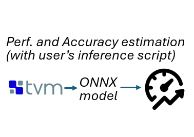
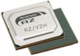
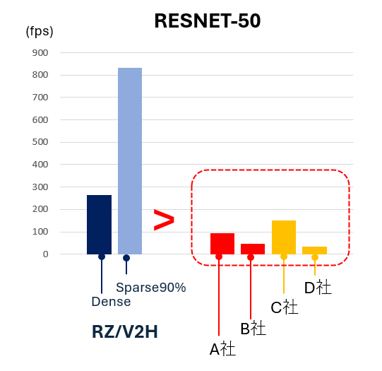

    

        

            DRP-AI TVM on RZ/V series
        

    

    

        

            

                <h5>
                    <i>
                        DRP-AI TVM is Machine Learning Compiler plugin for Apache TVM with AI accelerator DRP-AI provided by Renesas Electronics Corporation.
                    </i>
                </h5>
            

			

				
			

        

    

   

<h3 id="new">What's new</h3>

    

		

            <h6 align="right">2024.8.30</h6>
            <ul>
				<li>
					<b>RZ/V2H AI Applications and AI SDK on RZ/V series v5.00 </b> is now available.
					<ul>
						<li>RZ MPU Security Package for RZ/V2H AI SDK v5.00 is released.</li>
					</ul>
				</li>
				 
				For more details, see What's new of <a href="https://renesas-rz.github.io/rzv_ai_sdk/latest/">AI Applications and AI SDK on RZ/V series</a>.
            </ul>
        

        

            <h6 align="right">2024.7.31</h6>
            <ul>
				<li>
					<b>DRP-AI TVM v2.3.1 </b> is now available.
					<ul>
						<li>The bug on DRP-AI TVM has been fixed.</li>
					</ul>
				</li>
				 
				For more details, see Release Note of <a href="https://github.com/renesas-rz/rzv_drp-ai_tvm">DRP-AI TVM GitHub</a>.
            </ul>
        

    

   

<h3 id="Getting Started">Getting Started</h3>

DRP-AI TVM is provided as a tool for deploying AI models to RZ/V MPUs. In addition, an optional tool for pruning AI models (DRP-AI Extension Pack) is provided. Please refer to the following documents for how to use these tools.

    

        

            
        

        

            <b style="font-size:large; ">AI model compiler (DRP-AI TVM)</b> 
            <ul style="margin-top: 2%;">
				<li>Tool to convert wide-range AI models for RZ/V.</li>
				<li><a href="{{ site.baseurl }}/compile_sample_model.html">How to Compile Sample Model</a> : Tutorial with sample AI model (See here first).</li>
				<li><a href="{{ site.baseurl }}/compile_your_own_model.html">How to Compile Your Own Model</a>: Tutorial with your own AI model.</li>
            </ul>
        

    

     
    

        

            
        

        

            <b style="font-size:large; ">AI model pruning support tool (DRP-AI Extension Pack) for RZ/V2H</b> 
            <ul style="margin-top: 2%;">
				<li>Tool to provide a pruning function optimized for RZ/V2H.</li>
				<li><a href="{{ site.baseurl }}/pruning.html">How to Prune Your Own Model</a>: Tutorial for Pruning with your own AI model.</li>
            </ul>
        

    

   

<h3 id="Features">Features of DRP-AI development environments</h3>

    

		

            
        

        

            <b style="font-size:large; ">BYOM (Bring Your Own Model) support</b>
			<ul style="margen-top: 2%;">
				<li>
					For engineers with experience in AI development, "DRP-AI TVM", an end-to-end tool is provided, which allow users deploy users' own AI models on the RZ/V. 
					For details, see <a style="font" href="{{ site.baseurl }}/compile_your_own_model.html">BYOM tutorial</a>. 
				</li>
				<li>
					For engineers with no experience in AI development, "Renesas AI applications" are provided, which allow users to use pre-trained models and apps as is. 
					For details, see <a href="https://renesas-rz.github.io/rzv_ai_sdk/latest/">Renesas AI Applications</a>. 
				</li>
            </ul>
        

    

     
	
    

        

            
        

        
     
            <b style="font-size:large; ">Multiple AI framework support</b>
			<ul style="margin-top: 2%;">
				<li>DRP-AI TVM is provided, which is optimized for DRP-AI and is based on Apache TVM, a widely used open source AI compiler.</li>
				<li>AI models from multiple AI frameworks (ONNX, Pytorch, Tensorflow) can be converted into object files that can be executed on the RZ/V series.(*)</li>
                <small>(*) Pruning model generation support is available only for Pytorch and Tensorflow.</small>
				<li>By combining Renesas' AI accelerator "DRP-AI" with the ARM CPU, more AI models can be run on the RZ/V.</li>
            </ul>
        

    

     
	
    

        

            
        

        
   
            <b style="font-size:large; ">Optimized for the AI accelerator on RZ/V (DRP-AI)</b>
			<ul style="margin-top: 2%;">
				<li>High power efficiency is achieved through cooperation between hardware (DRP-AI) and software (DRP-AI Tool).</li>
				<li>By using the DRP-AI Tool, you can easily deploy AI models that are optimized to maximize the performance of DRP-AI.</li>
				<li>In addition, for the RZ/V2H, it is possible to generate pruning models optimized for the DRP-AI architecture, resulting in higher power efficiency.</li>
				<li>For details, see below:</li>
				<ul style="margin-top: 2%;">
					<li><a href="https://www.renesas.com/us/en/document/whp/embedded-ai-accelerator-drp-ai">Overview of DRP-AI hardware and tool optimization technology (whitepaper)</a></li>
					<li><a href="https://www.renesas.com/us/en/document/whp/next-generation-highly-power-efficient-ai-accelerator-drp-ai3-10x-faster-embedded-processing?r=25471761">Overview of optimization technology for lightweight models of RZ/V2H (V2H whitepaper)</a></li>
				</ul>
			</ul>
		

	

	 
	 
    

        

            
        

        
    
            <b style="font-size:large; ">AI model weight reduction support(RZ/V2H)</b>
			<ul style="margin-top: 2%;">
				<li>The built-in calibration function of DRP-AI TVM automatically generates INT8 models that are lighter than FP32 AI models.(*)</li>
                <small>(*) A few dozen sample images are required.</small>
				<li>A pruning tool is provided to reduce the weight data of AI models by up to approximately 90%.(**)</li>
                <small>(**) Patches and guides for modifying the AI ​​framework's training script for DRP-AI will be provided as an Extension Pack. The training script for Pytorch or Tensorflow must be prepared by the user.</small>
				<li>For details, see below:</li>
				<ul style="margin-top: 2%;">
					<li><a href="https://github.com/renesas-rz/rzv_drp-ai_tvm/blob/main/pruning/README.md">The AI model weight reduction</a></li>
				</ul>
			</ul>
        

    

     
	
    

		

			
		

		

			<b style="font-size:large; ">A function to check performance and accuracy before implementation on a device</b>
			<ul style="margin-top: 2%;">
				<li>Supports estimating and outputting the inference time when implementing on a device when compiling an AI model in DRP-AI TVM.</li>
				<li>Supports "Interpreter mode" that outputs quantized AI models in ONNX format. The same scripts as for the pre-quantization AI model (**) can be used, making it easy to check the recognition accuracy, etc.</li>
				<small>(**) The inference script must be prepared by the user.</small>
			</ul>
		

    

   

<h3 id="Reference">Reference sample applications</h3>

To support the development of applications using DRP-AI TVM, source code for sample applications of representative AI tasks is provided. Please use them as a reference for how to implement the API of DRP-AI TVM, how to input images from a camera connected to an evaluation board, and how to output inference results to an HDMI display, etc.

    

        

			       
        

        

			<b>Classification (ResNet50v1)</b> 
			<a href="https://github.com/renesas-rz/rzv_drp-ai_tvm/tree/main/how-to/sample_app_v2h/app_resnet50_cam">Source Code</a> 
			<a href="https://players.brightcove.net/5260471205001/default_default/index.html?videoId=6361754527112">Video</a>
        

        

            
        

        

            <b>Object Detection (YOLOX-s)</b> 
			<a href="https://github.com/renesas-rz/rzv_drp-ai_tvm/tree/main/how-to/sample_app_v2h/app_yolox_cam">Source Code</a> 
			<a href="https://players.brightcove.net/5260471205001/default_default/index.html?videoId=6361754914112">Video</a>
        

        

            
        
 
        

            <b>Pose Estimation (HRNet)</b> 
			<a href="https://github.com/renesas-rz/rzv_drp-ai_tvm/tree/main/how-to/sample_app_v2h/app_hrnet_cam">Source Code</a> 
			<a href="https://players.brightcove.net/5260471205001/default_default/index.html?videoId=6361753453112">Video</a>			
        

        

             
        
 
        

            <b>Semantic Segmentation (DeepLabV3)</b> 
			<a href="https://github.com/renesas-rz/rzv_drp-ai_tvm/tree/main/how-to/sample_app_v2h/app_deeplabv3_cam">Source Code</a> 
			<a href="https://players.brightcove.net/5260471205001/default_default/index.html?videoId=6361756400112">Video</a>
        

	

   

<h3 id="Demo">Demo</h3>

With the demo binary, users can try the Reference sample applications using GUI application. 
Download the Demo Binary and refer to How to Use Guide for more details.

<ul style="margin-top: 2%;">
	<li><a href="https://www.renesas.com/us/en/document/sws/rzv2haiperformancedemosdimagewicgz">Demo Binary</a> : SD card image file. </li>
	<li><a href="https://www.renesas.com/us/en/document/sws/rzmpudemoapplicationsoftware-license-agreement-description">License</a>: OSS license list for software included in the SD card image file.</li>
	<li><a href="./gui_demo.html">How to Use Guide</a>: A quick guide to using SD card image.</li>
</ul>

   

<h3 id="Video">Video</h3>

Following videos show the overview of DRP-AI TVM. Refer to them first to understand the overview.

    

        

                     
        

        

            <a href="https://players.brightcove.net/5260471205001/default_default/index.html?videoId=6361751962112">DRP-AI TVM overview</a>
        

        

             
        

        

            <a href="https://www.youtube.com/watch?v=IqeZnVBEUxY">How to run ONNX model (YouTube)</a> 
        

	

   

<h3 id="hardware">Target hardware</h3>

    

        

            
        

        

            <b style="font-size:large; ">RZ/V series with dedicated AI accelerator (DRP-AI)</b>  
            <ul style="margin-top: 2%;">
				<li>Highly power efficient and flexible by co-operation between high-speed MAC unit for AI and Dynamically Reconfigurable Processor (DRP)</li>
				<li>RZ/V2H supports efficient calculation of compacted AI models (INT8 quantization and pruning (option))</li>
            </ul>
        

	

 

<table class="gstable ms-4 mb-1 Target">
    <tr>
        <th style="text-align: center;" width=160></th>
        <th style="text-align: center;" width=160>RZ/V2L</th>
        <th style="text-align: center;" width=160>RZ/V2MA</th>
        <th style="text-align: center;" width=160>RZ/V2M</th>
        <th style="text-align: center;" width=160>RZ/V2H</th>
    </tr>
    <tr>
        <td></td>
        <td></td>
        <td></td>
        <td></td>
        <td></td>
    </tr>
    <tr>
        <td>CPU</td>
        <td>Cortex-A55 Dual/Single Cortex-M33 Single</td>
        <td>Cortex-A53 Dual</td>
        <td>Cortex-A53 Dual</td>
        <td>Cortex-A55 Quad Cortex-M33 Single</td>
    </tr>
    <tr>
        <td>AI accelerator</td>
        <td>DRP-AI 1 TOPS</td>
        <td>DRP-AI 1 TOPS</td>
        <td>DRP-AI 1 TOPS</td>
        <td>DRP-AI3 8 Dense TOPS 80 Sparse TOPS</td>
    </tr>
    <tr>
        <td>Data type</td>
        <td>FP16</td>
        <td>FP16</td>
        <td>FP16</td>
        <td>INT8</td>
    </tr>
    <tr>
        <td>Compaction model support</td>
        <td>-</td>
        <td>-</td>
        <td>-</td>
		<td>Performance    optimization for    pruned model</td>          </tr>
    <tr>
        <td>Production page</td>
        <td><a href="https://www.renesas.com/jp/ja/products/microcontrollers-microprocessors/rz-mpus/rzv2l-general-purpose-microprocessor-equipped-renesas-original-ai-accelerator-drp-ai-12ghz-dual-core-arm">Link</a></td>
        <td><a href="https://www.renesas.com/jp/ja/products/microcontrollers-microprocessors/rz-mpus/rzv2ma-vision-ai-opencv-accelerator">Link</a></td>
		<td><a href="https://www.renesas.com/jp/ja/products/microcontrollers-microprocessors/rz-mpus/rzv2m-ai-accelerator-drp-ai-4k-compatible-image-signal-processor-isp-vision-ai-assp-real-time-human-and">Link</a></td>
		<td><a href="https://www.renesas.com/jp/ja/products/microcontrollers-microprocessors/rz-mpus/rzv2h-quad-core-vision-ai-mpu-drp-ai3-accelerator-and-high-performance-real-time-processor">Link</a></td>
    </tr>
</table>

   

<!--
<h3 id="examples">Performance examples</h3>

    

        

            <table class="gstable ms-4 mb-1 Performance">
				<tr>
					<th colspan="2" rowspan="2">AI Model</th>
					<th colspan="2" rowspan="1">Performance*1 [ msec ]</th>
					<th>Accuracy [%]</th>
				</tr>
				<tr>
					<td>Inference  (CNN)</td>
					<td>Total  (CNN+pre/post)</td>
					<td></td>
				</tr>
				<tr>
					<td rowspan="2">YOLOX-S</td>
					<td>Dense</td>
					<td style="text-align: center;">13.7</td>
					<td style="text-align: center;">20.1</td>
					<td style="text-align: center;">80.7</td>
				</tr>
				<tr>
					<td>Sparse (70% pruned)</td>
					<td style="text-align: center;">12.5</td>
					<td style="text-align: center;">18.9</td>
					<td style="text-align: center;">76.8</td>
				</tr>
				<tr>
					<td rowspan="2">YOLOv2</td>
					<td></td>
					<td style="text-align: center;">13.1</td>
					<td style="text-align: center;">18.1</td>
					<td style="text-align: center;">74.0</td>
				</tr>
				<tr>
					<td>Sparse (90)</td>
					<td style="text-align: center;">5.3</td>
					<td style="text-align: center;">10.3</td>
					<td style="text-align: center;">71.4</td>
				</tr>
				<tr>
					<td rowspan="2">DeepLabv3  (513x513)</td>
					<td>Dense</td>
					<td style="text-align: center;">134.7</td>
					<td style="text-align: center;">145.1</td>
					<td style="text-align: center;">61.7</td>
				</tr>
				<tr>
					<td>Sparse (90)</td>
					<td style="text-align: center;">101.9</td>
					<td style="text-align: center;">112.3</td>
					<td style="text-align: center;">58.6</td>
				</tr>
				<tr>
					<td rowspan="2">Resnet 50</td>
					<td>Dense</td>
					<td style="text-align: center;">3.8</td>
					<td style="text-align: center;">9.1</td>
					<td style="text-align: center;">73.9</td>
				</tr>
				<tr>
					<td>Sparse (90)</td>
					<td style="text-align: center;">1.2</td>
					<td style="text-align: center;">6.5</td>
					<td style="text-align: center;">71.3</td>
				</tr>
				<tr>
					<td rowspan="2">HRNet</td>
					<td>Dense</td>
					<td style="text-align: center;">12.3</td>
					<td style="text-align: center;">15.6</td>
					<td></td>
				</tr>
				<tr>
					<td>Sparse (90)</td>
					<td style="text-align: center;">9.4</td>
					<td style="text-align: center;">12.7</td>
					<td></td>
				</tr>
			</table>
        

		

			
		

	

-->
