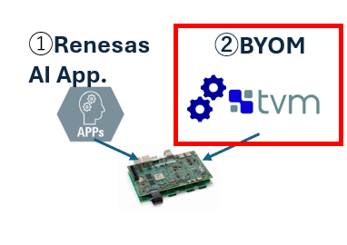
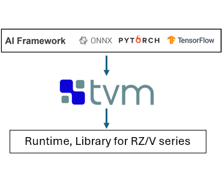
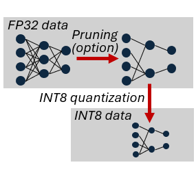
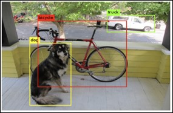
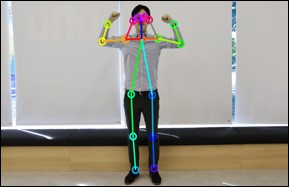
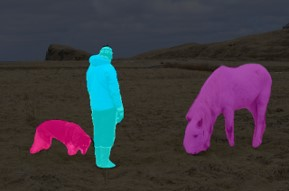

    

        

            DRP-AI TVM on RZ/V series
        

    

    

        

            

                <h5>
                    <i>
                        DRP-AI TVM is Machine Learning Compiler plugin for Apache TVM with AI accelerator DRP-AI provided by Renesas Electronics Corporation.
                    </i>
                </h5>
            

            

                
 
                    

                        
                        <ul class="downloads">
                            <li>
                                <a href="https://www.renesas.com/products/microcontrollers-microprocessors/rz-mpus/rzv2l-evkit-rzv2l-evaluation-board-kit">
                                    Get 
                                    the Board
                                </a>
                            </li>
                        </ul>
                    
                    
                    

                        
                        <ul class="downloads">
                            <li>
                                <a href="">
                                    Get 
                                    DRP-AI TVM &amp; extension pack
                                </a>
                            </li>
                        </ul>
                    

                

            

        

    

 

<h3 id="new">
    What's new
</h3>

    

        

            <h6 align="right">
                2024.4.5
            </h6>
            <ul>
              <li>
                <b>DRP-AI TVM v2.21 </b> is now available. 
                <ul>
                  <li>
                    The bug on DRP-AI TVM has been fixed.
                     
                  </li>
                </ul>
              </li>
            </ul>
        

          

            <h6 align="right">
              2024.2.29
            </h6>
            <ul>
              <li>
                <b>RZ/V2H AI SDK v3.00 </b> is now available. 
                <ul>
                  <li>
                    Support RZ/V2H 
                  </li>
                </ul>
              </li>
            </ul>
            For more details, see <a href="https://github.com/renesas-rz/rzv_drp-ai_tvm/releases">GitHub Release
              Note</a>.
             
        

    

 
 
 

<h3 id="Main tools">Main tools of DRP-AI development environments</h3>

        

          

            
          

          

            <b style="font-size:large; ">AI model compiler (DRP-AI TVM)</b>  
            <ul style="margin-top: 2%;">
              <li>Tool to convert wide-range AI models for RZ/V.</li>
            </ul>
          

        

         
        

          

            
          

          

            <b style="font-size:large; ">AI model pruning support tool (DRP-AI Extension Pack) for RZ/V2H</b>  
            <ul style="margin-top: 2%;">
              <li>Tool to provide a pruning function optimized for RZ/V2H.</li>
            </ul>
          

        

         

 
 
 

<h3 id="Features">Features of DRP-AI development environments</h3>

        

          

              
          

          

            <ul style="margin-top: 2%;">
            <b style="font-size:large; ">BYOD (Bring Your Own Model)対応</b>  
              <li>AI開発経験のあるエンジニア向けツールとして、ユーザ独自のAIモデルをRZ/V上で推論するまでのend-to-endなツールを提供。  
                <a style="font" href="https://www.youtube.com/watch?v=IqeZnVBEUxY">(DRP-AI TVMを用いた実装方法の概要はこちら(youtube))</a>
              </li>
              <li>AI開発になじみがないユーザ向けには、Renesasで学習済みのモデルやアプリをそのまま活用可能なRenesas AI applicationを用意しています。 
                <a href="https://renesas-rz.github.io/rzv_ai_sdk/latest/">(AI apps.ページはこちら)</a>
              </li>
            </ul>
          

        

          
        

          

            
          

          

            <ul style="margin-top: 2%;">          
            <b style="font-size:large; ">多様なAIフレームワークモデルに対応</b>  
              <li>オープンソースのAIコンパイラとして広く用いられているApache TVMをベースに、DRP-AI向けに最適化したDRP-AI TVMを提供。
              </li>
              <li>多様なフレームワーク(ONNX・Pytorch・Tensorfolw)からRZ/V seriesで実行可能なファイルに変換できます(*)。 
                (*)枝刈りモデルの生成サポートはPytorch,Tensorflowのみ
              </li>
              <li>DRP-AIとARM CPUが連携動作するランタイムにより、さらに多くのAIモデルがRZ/Vで動作可能になります。
              </li>
            </ul>
          

        

          
        

          

            
          

          

            <ul style="margin-top: 2%;">          
            <b style="font-size:large; ">AI accelerator on RZ/V (DRP-AI)に最適化</b>  
              <li>ハードウェア(DRP-AI)とソフトウェア(DRP-AIツール)の協調により、高い電力効率を実現しています。
              </li>
              <li>DRP-AIツールを使うことで、簡単にDRP-AIの性能を最大限引き出すように最適化された状態でAIモデルを実装できます。
              </li>
              <li>さらにRZ/V2Hでは、DRP-AIアーキテクチャの特徴を考慮した枝刈りモデル生成機能などを用いることで、より高い電力効率を実現します。
              </li>
              <a href="https://www.renesas.com/jp/ja/document/whp/embedded-ai-accelerator-drp-ai">DRP-AIのハード・ツール最適化技術の概要はこちら(whitepaper)</a> 
              <a href="https://www.renesas.com/jp/ja/document/whp/next-generation-highly-power-efficient-ai-accelerator-drp-ai3-10x-faster-embedded-processing?r=25471761">(RZ/V2H)向け軽量化モデルにおける最適化技術の概要かこちら(V2H whitepaper)</a>
            </ul>
          

        

          
        

          

            
          

          

            <ul style="margin-top: 2%;">          
            <b style="font-size:large; ">軽量化AIモデルの生成・実装をサポート(RZ/V2H)</b>  
              <li>DRP-AI TVM内臓のキャリブレーション機能(*)により、32ビットデータのAIモデルよりも軽量なINT8モデルを自動的に生成します。
                (*)数10枚程度のサンプル画像が必要です。
              </li>
              <li>AIモデルの重みデータを最大で約90%削減するAIモデル枝刈りを行うサポートツールを提供(**)。 
                (**)学習スクリプトをDRP-AI向けに最適化するパッチ・ガイドをExtension Packとして準備しています。学習用のPytorch・Tensorflowスクリプトは、ユーザで用意して頂く必要があります。
              </li>
              <a href="https://github.com/renesas-rz/rzv_drp-ai_tvm/blob/main/pruning/README.md">軽量化に関する詳細はこちら</a>
            </ul>
          

        

         
     

       

         
       

       

         <ul style="margin-top: 2%;">
         <b style="font-size:large; ">デバイス実装前に性能や制度を確認する機能</b>  
           <li>DRP-AI TVMでコンパイル時に、デバイス実装時の処理時間を推定して出力する機能を搭載。
           </li>
           <li>軽量化AIモデルをONNX形式で出力するinterpreter modeを搭載。軽量化前のAIモデルと同じ推論スクリプト(**)が使えるため、認識精度などの確認が容易になります。 
             (**)推論スクリプトはユーザで用意して頂く必要があります。
           </li>
         </ul>
       

     

      

 
 
 

<h3 id="Software stack">Software stack of DRP-AI development environments</h3>

 
 
 

<h3 id="Reference">Reference sample applications</h3>

DRP-AI TVMを使用したアプリケーションの開発を支援するために代表的なAIタスクのサンプルアプリケーションのソースコードを提供します。DRP-AI TVMのAPIの実装方法、評価ボードに接続したカメラからの画像の入力方法、HDMIディスプレイへの推論結果の出力方法等の参考としてご利用ください。

        

          

                     
          

          

              <a href="">Classification ResNet50v1</a>
          

          

             
          

          

              <a href="">Object Detection YOLOX-s</a> 
          

          

             
          
 
          

              <a href="">Human Pose Estimation HRNet</a>
          

          

              
          
 
          

              <a href="">Semantic Segmentation DeepLabV3</a>
          

 
 
 

<h3 id="hardware">Target hardware</h3>

        

          

            
          

          

            <b style="font-size:large; ">RZ/V series with dedicated AI accelerator (DRP-AI)</b>  
            <ul style="margin-top: 2%;">
              <li>Highly power efficient and flexible by co-operation between high-speed MAC unit for AI and Dynamically
                Reconfigurable Processor (DRP)</li>
              <li>RZ/V2H supports efficient calculation of compacted AI models (INT8 quantization and pruning (option))
              </li>
            </ul>
          

          
        <table class="gstable ms-4 mb-1 Target">
          <tr>
            <th style="text-align: center;"></th>
            <th style="text-align: center;">RZ-V2H</th>
            <th style="text-align: center;">RZ/V2MA</th>
            <th style="text-align: center;">RZ/V2M</th>
            <th style="text-align: center;">RZ/V2L</th>
          </tr>
          <tr>
            <td></td>
            <td></td>
            <td></td>
            <td></td>
            <td></td>
          </tr>
          <tr>
            <td>CPU</td>
            <td>Cortex-A55 x 4    Cortex-R8 x 2    Cortex-M33</td>
            <td>Cortex-A53 x 2</td>
            <td>Cortex-A53 x 2</td>
            <td>Cortex-A55 x 2      Cortex-M33</td>
          </tr>
          <tr>
            <td>AI accelerator</td>
            <td>DRP-AI3    8 Dense TOPS    80 Spare TOPS</td>
            <td>DRP-AI1    1 TOPS</td>
            <td>DRP-AI1    1 TOPS</td>
            <td>DRP-AI    1 TOPS</td>
          </tr>
          <tr>
            <td>Data Type</td>
            <td>INT8</td>
            <td>FP16</td>
            <td>FP16</td>
            <td>FP16</td>
          </tr>
          <tr>
            <td>Compaction model support</td>
            <td>Performance    optimization for    pruned model</td>
            <td>-</td>
            <td>-</td>
            <td>-</td>
          </tr>
          <tr>
            <td>Production page</td>
            <td>Link</td>
            <td>Link</td>
            <td>Link</td>
            <td>Link</td>
          </tr>
        </table>

 
 
 

<h3 id="examples">Performance examples</h3>

        

          

            <table class="gstable ms-4 mb-1 Performance">
              <tr>
                <th colspan="2" rowspan="2">AI Model</th>
                <th colspan="2" rowspan="1">Performance*1 [ msec ]</th>
                <th>Accuracy [%]</th>
              </tr>
              <tr>
                <td>Inference  (CNN)</td>
                <td>Total  (CNN+pre/post)</td>
                <td></td>
              </tr>
              <tr>
                <td rowspan="2">YOLOX-S</td>
                <td>Dense</td>
                <td style="text-align: center;">13.7</td>
                <td style="text-align: center;">20.1</td>
                <td style="text-align: center;">80.7</td>
              </tr>
              <tr>
                <td>Sparse (70% pruned)</td>
                <td style="text-align: center;">12.5</td>
                <td style="text-align: center;">18.9</td>
                <td style="text-align: center;">76.8</td>
              </tr>
              <tr>
                <td rowspan="2">YOLOv2</td>
                <td></td>
                <td style="text-align: center;">13.1</td>
                <td style="text-align: center;">18.1</td>
                <td style="text-align: center;">74.0</td>
              </tr>
              <tr>
                <td>Sparse (90)</td>
                <td style="text-align: center;">5.3</td>
                <td style="text-align: center;">10.3</td>
                <td style="text-align: center;">71.4</td>
              </tr>
              <tr>
                <td rowspan="2">DeepLabv3  (513x513)</td>
                <td>Dense</td>
                <td style="text-align: center;">134.7</td>
                <td style="text-align: center;">145.1</td>
                <td style="text-align: center;">61.7</td>
              </tr>
              <tr>
                <td>Sparse (90)</td>
                <td style="text-align: center;">101.9</td>
                <td style="text-align: center;">112.3</td>
                <td style="text-align: center;">58.6</td>
              </tr>
              <tr>
                <td rowspan="2">Resnet 50</td>
                <td>Dense</td>
                <td style="text-align: center;">3.8</td>
                <td style="text-align: center;">9.1</td>
                <td style="text-align: center;">73.9</td>
              </tr>
              <tr>
                <td>Sparse (90)</td>
                <td style="text-align: center;">1.2</td>
                <td style="text-align: center;">6.5</td>
                <td style="text-align: center;">71.3</td>
              </tr>
              <tr>
                <td rowspan="2">HRNet</td>
                <td>Dense</td>
                <td style="text-align: center;">12.3</td>
                <td style="text-align: center;">15.6</td>
                <td></td>
              </tr>
              <tr>
                <td>Sparse (90)</td>
                <td style="text-align: center;">9.4</td>
                <td style="text-align: center;">12.7</td>
                <td></td>
              </tr>
          </table>
        

  

          
  

