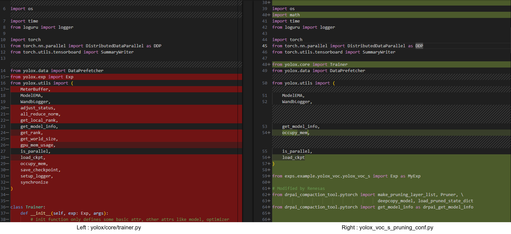

## Introduction
Nodes are interconnected in a neural network as shown in the figure below. Methods of reducing the number of parameters by removing weights between nodes or removing nodes are referred to as “pruning”. A neural network to which pruning has not been applied is generally referred to as a dense neural network.
Applying pruning to a neural network leads to a slight deterioration in the accuracy of the model but can reduce the power required by hardware and accelerate the inference process.

  Note
    In the use of pruning tool for DRP-AI, we recommend pruning by at least 70% to improve the processing performance of the DRP-AI.

# Video

    <iframe src="https://players.brightcove.net/5260471205001/default_default/index.html?videoId=6362851954112"
    allowfullscreen
    webkitallowfullscreen
    mozallowfullscreen></iframe>

 

## Work flow
DRP-AI for RZ/V2H supports the feature of efficiently calculating the pruned AI model. Therefore, power efficiency is improved by using the pruned AI model.  
This document explains how to prune your own model by using DRP-AI Extension package, which provides a pruning function optimized for the DRP-AI.  
In this case, yolox-s provided by [Megvii-BaseDetection framework](https://github.com/Megvii-BaseDetection/YOLOX/tree/0.3.0) is used as an example to explain it.  

This document follows the following steps.  

In 2-1. this step performs initial training. Initial training involves training of the AI model without pruning. Use the code for use in initial training and a dataset you have prepared.
If you have pretarained model, you can skip this chapter.  
In 2-2, this step performs pruning your own model. This step includes retraining of the AI model by adding
the DRP-AI Extension Pack to the code for use in initial training.  
In 2-3, this step checks the accuracy of the pruned model after one round of pruning then retraining has been completed.  

1. [Setup the DRP-AI Extension Pack](#1-setup)  
    1-1. [Download the DRP-AI Extension Pack](#1-1)  
    1-2. [Setup the DRP-AI Extension Pack with Docker](#1-2)  
    1-3. [ Setup the training environment for your own model](#1-3)  

2. [Prune your model](#2-prune-your-model)  
    2-1. [Prepare the datasets and pre-trained model for your own model](#2-1-prepare-the-datasets-and-pre-trained-model)  
    2-2. [Prune the model (YOLOX-s)](#2-2-pruning-then-retraining)  
    2-3. [Test the pruned model](#2-3-test-the-pruned-model)  

<!--
# Video

  <iframe src=""
  allowfullscreen
  webkitallowfullscreen
  mozallowfullscreen></iframe>

-->

# 1. Setup the DRP-AI Extension Pack

  Note1
    If you have set up your development environment using docker such as DRP-AI TVM installation with Docker, exit the container once and create a docker image for this installation.

### 1-1. Download the DRP-AI Extension Pack
Download DRP-AI Extension Pack from below.  
<https://www.renesas.com/us/en/software-tool/drp-ai-extension-pack-pruning-tool>

### 1-2. Setup the DRP-AI Extension Pack with Docker

Preparing workspace

$ mkdir prune-work
$ cd prune-work
$ git clone https://github.com/renesas-rz/rzv_drp-ai_tvm.git
$ cd rzv_drp-ai_tvm/pruning/setup/docker
$ cp $HOME/Downloads/drpai-extension-pack_ver*.tar.gz ./


Comfirming necessary files.

$ ls
drpai-extension-pack_ver1.0.0.tar.gz  torch.Dockerfile


Build docker image.

$ sudo docker build -t drpai_ext_pt_img -f torch.Dockerfile .


Comfirming a docker image is built properly

$ sudo docker images | grep drpai_ext_pt_img
drpai_ext_pt_img                  latest                              XXXXXXXXXXXXX        X seconds ago       12.4GB


Please change to the working directory prepared for YOLOX and then execute the following command to run a docker image.


$ cd $HOME/prune-work/rzv_drp-ai_tvm/pruning/how-to/megvii-basedetection_yolox
$ sudo docker run -it --rm --shm-size=32gb --gpus all -v $(pwd):/workspace -w /workspace drpai_ext_pt_img

The local `$(pwd)` is mounted to `/workspace` on the Docker container by the above command option.

For example, you can use this directory to copy files created on the Docker container to your local environment.

### 1-3. Setup the training environment for your own model
In this chapter, install python libraries needed to run and create codes for pruning then retraing.

root@docker_hostname:# ./setup.sh
root@docker_hostname:# ls
YOLOX/ patch/ setup.sh README.md


Move to the working directory with the following command.


root@docker_hostname:# cd YOLOX
root@docker_hostname:# ls
torch2onnx.py yolox_voc_s_pruning_conf.py onnx_voc_evaluator.py eval_with_pruned_model.py yolox/


# 2. Prune your model

  Note
    This chapter takes <u><b>a long time</b></u> to retrain the AI model.  
    In our environment (Tesla V100 was used), it takes about <u><b>4days</b></u>.  
    If only want to validate RZ/V2H operation, please skip this chapter.

### 2-1. Prepare the datasets and pre-trained model for your own model

  Note
    This step performs initial training. Initial training involves training of the AI model without pruning. Use the code for use in initial training and a dataset you have prepared.
    If you have pretarained model, you can skip this chapter.

In this tutorial use the pascal VOC dataset. 
To find more details please visit [http://host.robots.ox.ac.uk/pascal/VOC/](http://host.robots.ox.ac.uk/pascal/VOC/).  
Please download the dataset present at the following links.
- http://host.robots.ox.ac.uk/pascal/VOC/voc2007/VOCtrainval_06-Nov-2007.tar
- http://host.robots.ox.ac.uk/pascal/VOC/voc2007/VOCtest_06-Nov-2007.tar 
- http://host.robots.ox.ac.uk/pascal/VOC/voc2012/VOCtrainval_11-May-2012.tar


root@docker_hostname:# mkdir -p datasets
root@docker_hostname:# tar xvf VOCtrainval_06-Nov-2007.tar -C datasets
root@docker_hostname:# tar xvf VOCtest_06-Nov-2007.tar -C datasets
root@docker_hostname:# tar xvf VOCtrainval_11-May-2012.tar -C datasets
root@docker_hostname:# ls datasets/VOCdevkit
 VOC2012/ VOC2007/


To create the initial trained model, this chapter uses the COCO pretrained-model provided by Megvii-BaseDetection for initializing the model.
Initial training can be performed by executing the following command


root@docker_hostname:# wget https://github.com/Megvii-BaseDetection/YOLOX/releases/download/0.1.1rc0/yolox_s.pth
root@docker_hostname:# python3 -m yolox.tools.train -f exps/example/yolox_voc/yolox_voc_s.py -c yolox_s.pth -d 1 -b 64 --fp16 -o


  Note
    <li> -f: experiment description file </li>
    <li> -c: checkpoint file  </li>
    <li> -d: number of gpu devices  </li>
    <li> -b: total batch size  </li>
    <li> --fp16: mixed precision training  </li>
    <li> -o: occupy GPU memory first for training. </li>

After training is finished, the trained weight is contained in the `YOLOX_outputs/yolox_voc_s` folder. 
And the trained weight is named `best_ckpt.pth`.

root@docker_hostname:# ls YOLOX_outputs/yolox_voc_s
... best_ckpt.pth train_log.txt tensorboard/


### 2-2. Pruning then retraining
This step performs pruning your own model. This step includes retraining of the AI model by adding the DRP-AI Extension Pack to the code for use in initial training.  
In Steps 1-3, the code with the DRP-AI Extension Pack has already been output.
Therefore, read on [here](#perform-pruning-then-retraining) if you would like to do pruning then retraining now.  
If you would like to know how the DRP-AI Extension Pack is added, please continue reading. 

  Note
    Please also refer to <a href="https://www.renesas.com/us/en/software-tool/drp-ai-extension-pack-pruning-tool">DRP-AI Extension Pack UM</a>.

The following file is the code with the DRP-AI Extension Pack. In the case of  YOLOX, this file will be used to do the pruning then retraining.  
　`yolox_voc_s_pruning_conf.py`  
And this step explains how the DRP-AI Extension Pack is added using this file as an example.

In YOLOX, initial training is executed using a class called <a href="https://github.com/Megvii-BaseDetection/YOLOX/blob/main/yolox/core/trainer.py">_Trainer_</a>.
The _`Trainer class`_ provides a number of easy-to-use functions, such as the _before_train()_ function to be called before training and the _before_epoch()_ function to be called before the start of one epoch.


class Trainer:
  def train(self): # function to execute training
  
   def before_train(self):  # function called before training

   def before_ecoch(self): # function called before the start of one epoch

.... #Other functions exist



Extend (inherit) the functionality of this Trainer and add the DRP-AI Extension Pack.
The DRP-AI Extension Pack is added to the following functions in the Trainer class.

  - resume_train(): aunction called when loading trained weights
  - before_train(): Function called before training
  - before_iter(): Function called before 1 iteration  

Specifically, the DRP-AI Extension Pack is added to the YOLOX code in the following four steps.  

(1). **Importing the DRP-AI Extension Pack module**  
(2). **Loading the trained model**　(edit resume_train() fucntion)  
(3). **Preparing for pruning the model**　(edit before_train() function)  
(4). **Updating the pruning parameters** (edit before_iter() function)  

##### (1). **Importing the DRP-AI Extension Pack module**  
Import the DRP-AI Extension Pack module to the code written with PyTorch for use in initial training.  
Specifically, the DRP-AI Extension Pack is added on lines 62-64 on the right side.  
Below is the difference between yolox/core/trainer.py and yolox_voc_s_pruning_conf.py that is used to train. The red parts are the deleted parts and the green parts are the added parts.  
The deleted sections are used in yolox/core/trainer.py but not in yolox_voc_s_pruning_conf.py, so they have been removed.  

  
Click for more details

        

 

##### (2). **Loading the trained model**  
Load the trained model to initialize the model weights.  
Lines 190-193 on the right side of the figure below are the relevant sections.  
Here, the _resume_train()_ function in the Trainer class is modified to load the initial trained model.  
The _resume_train()_ function is called when loading learned weights.  
In order to be able to load pruning then retrained models, the _load_pruned_state_dict()_ function is used in lines 194-196 on the right side.  

  
Click for more details

      

 

##### (3). **Preparing for pruning the model**  
Execute the pruning API function to prepare for pruning the model.   
After the pruning API function has been executed, confirming that pruning has been performed with the _get_model_info()_ function is recommended.  
Lines 136-145 on the right side of the figure below are the relevant sections.  
The _before_train()_ function in the Trainer class is modified to call the pruning API.  
The _before_train()_ function is called once before training.

In addition, the following modifications are made as unique changes to the code in this tutorial. Normally, you do not need to make these changes. (These are proprietary modifications that are required by YOLOX.)    
1. The code in this tutorial uses the environment variable _PRUNING_RATE_ to allow the pruning rate to be set.  
Lines 129-135 on the right side are where the environment variable is used to obtain the pruning rate.  
2. The code in this tutorial changes from an EMA to the EMA that is valid for the pruned model.  
Lines 148-150 on the right side are the relevant sections, changing from _ModelEMA()_ to _PrunedModelEMA()_.  

※EMA:  Abbreviation of Exponential Moving Average.

  
Click for more details

      

 

##### (4). **Updating the pruning parameters**  
Update the pruning parameters during training. The API function (_pruner.update()_) must be called at the start of each iteration.  
Lines 176 on the right side of the figure below are the relevant sections.  
Normally, _pruner.update()_ should be called at the beginning of each iteration.  
For YOLOX, _modify before_iter()_ function in the Trainer class and call it at the beginning of each iteration.    
Specifically, pruning parameters is updated in the _before_iter()_ function in the Trainer class.  
The _before_iter()_ function is called before one iteration of training. Updating the pruning parameters here allows the pruning parameters to be updated at the start of each iteration.  

  
Click for more details

      

  
 

##### **Perform pruning then retraining**
Pruning then retraining can be performed by executing the following command. 
For more information about this options, please click [here](https://github.com/Megvii-BaseDetection/YOLOX/blob/0.3.0/docs/quick_run.md#3reproduce-our-results-on-coco).   
This chapter uses the trained model on VOC which is created above for initializing the model.  


root@docker_hostname:# PRUNING_RATE=0.7 python3 -m yolox.tools.train -f yolox_voc_s_pruning_conf.py -c YOLOX_outputs/yolox_voc_s/best_ckpt.pth -d 1 -b 32 --fp16 -o


  Note1
    The pruning rate is set as an environment variable (PRUNING_RATE) in this tutorial. 
    When performing the pruning then retraining, please set `PRUNING_RATE` environment variable.

  Note2
    We recommend using the same parameters for pruning then retraining, such as epoch and batch size, as those that were set for initial training. 
    However, in this tutorial the batch size is changed from 64 to 32 because of our GPU memory limitations.  
    If you have a high performance GPU, please set the batch size to 64.

After retraining, the `YOLOX_outputs/yolox_voc_s_pruning_conf` folder can be confirmed.  
And the trained weight is named `best_ckpt.pth`.


root@docker_hostname:# ls YOLOX_outputs/yolox_voc_s_pruning_conf
... best_ckpt.pth train_log.txt tensorboard/


### 2-3. Test the pruned model
Finally, check the accuracy of the AI model after one round of pruning then retraining has been completed.  
In this chapter, the accuracy of the pruned model is measured to ensure that its accuracy is maintained after pruning then retraining.

Convert pytorch format model to onnx format model first.  
For more information about this options, please click [here](https://github.com/Megvii-BaseDetection/YOLOX/tree/0.3.0/demo/ONNXRuntime#convert-your-model-to-onnx).  

root@docker_hostname:# python3 torch2onnx.py -f yolox_voc_s_pruning_conf.py -c YOLOX_outputs/yolox_voc_s_pruning_conf/best_ckpt.pth --output-name pruned_model.onnx --is_pruned_weight


Test the pruned model with onnx format.  
For more information about this options, please click [here](https://github.com/Megvii-BaseDetection/YOLOX/blob/0.3.0/docs/quick_run.md#4evaluation).   

root@docker_hostname:# python3 eval_with_pruned_model.py -f yolox_voc_s_pruning_conf.py -c pruned_model.onnx -b 1 -d 1 --conf 0.001


The following log can be confirmed. It shows the accuracy of the trained model.

...
map_5095: 0.6120537790481723
map_50: 0.8182438030405812
...


(Option) If test the pruned model with pytorch format, please run the following command.

root@docker_hostname:# python3 eval_with_pruned_model.py -f yolox_voc_s_pruning_conf.py -c YOLOX_outputs/yolox_voc_s_pruning_conf/best_ckpt.pth -b 64 -d 1 --conf 0.001 --is_pruned_weight --use_pytorch_model


**Here is the end of the workflow.**  
The next step is to deploy this pruned model. [Go to the next page.](./compile_your_own_model.html)

# Appendix

## FAQ
### IndexError: Caught IndexError in DataLoader worker process 0. or RuntimeError: Pin memory thread exited unexpectedly
If the above error occured during the training or retraining, please retry the training or retraining command.

### RuntimeError: cuDNN error: CUDNN_STATUS_INTERNAL_ERROR
If the above error occured during the training or retraining, please remove `-o` option from the training or retraining command.

### UserWarning: CUDA initialization: Unexpected error from cudaGetDeviceCount().
Please update nvidia driver on host pc. 

## Tips
### How to find difference between code for initial training and code for pruning then retraining
Please execute the following command to find difference between code for initial training and code for pruning then retraining. 

You can find how to add the DRP-AI Extension Pack APIs to code for initial training.


$ diff -u yolox/core/trainer.py yolox_voc_s_pruning_conf.py


### Reference: Accuracy results of pruning then retraining
When pruning then retraining was performed in our environment, the accuracy results were shown as follows.

||mAP@0.5|
|:---:|:---:|
|Baseline|82.50%|
|Pruning rate 70%|81.80%|

  Note
    This information is just for reference purposes because the above results are not guaranteed.

## Usage Notes
- Do not use Exponential Moving Average (EMA) with gradual pruning. It may cause incorrect pruning result.  
Note: For YOLOX, the default training setting uses EMA.
