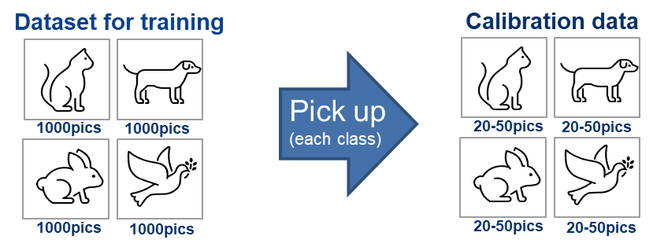
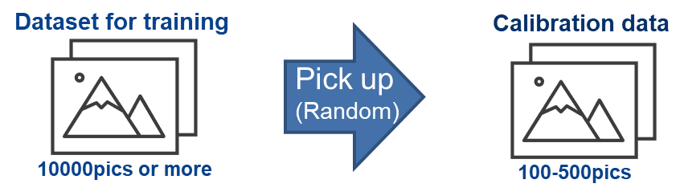

## (Option) How to accelerate the AI model by pruning.

The DRP-AI Extension Pack is pruning tools for accelerating the AI model. For more details about how to prune the model, Please refer to [here](../pruning/how-to/torchvision_resnet50/README.md).

# Compile with Sample Scripts (RZ/V2H)
There are three types of sample scripts to compile an AI model.

1. Compile script with onnx model \[CPU and DRP-AI accelerator\]
2. Compile script with pytorch model \[CPU and DRP-AI accelerator\]
3. Compile script with tensorflow model \[CPU and DRP-AI accelerator\]
4. Compile script with onnx model \[Only CPU\]

All scripts use the DRP-AI Pre-processing Runtime Compile Module to generate Object files for pre-processing, which is `preprocess` directory in the output directory.  
For more details on DRP-AI Pre-processing Runtime, please refer to its [Documentation](../docs/PreRuntime.md).

## 1. Compile onnx models

### 1.1. Example using Resnet from the official ONNX model zoo

```sh
cd $TVM_ROOT/tutorials/

# Download onnx model from official ONNX model zoo
wget https://github.com/onnx/models/raw/main/validated/vision/classification/resnet/model/resnet50-v1-7.onnx

python3 compile_onnx_model_quant.py \
    ./resnet50-v1-7.onnx \
    -o resnet50_v1_onnx \
    -t $SDK \
    -d $TRANSLATOR \
    -c $QUANTIZER \
    --images $TRANSLATOR/../GettingStarted/tutorials/calibrate_sample/ \
    -v 100 

```

<!--
# You can also use the model which has been pruned before this section.
# Use random input for quantize calibration.
python3 compile_onnx_model_quant.py \
    ./resnet50-v1-7.onnx \
    -o resnet50_v1_onnx \
    -t $SDK \
    -d $TRANSLATOR \
    -c $QUANTIZER \
    -n 10 \
    -v 100
-->

## 2. Compile pytorch models

### 2.1. Example using Resnet from torchvision

```sh
cd $TVM_ROOT/tutorials/
# Download resnet18 model from torchvision & save it as resnet18.pt
pip3 install torchvision==0.9.1
python3 sample_save_torch_model.py
pip3 install torchvision==0.16.2 --index-url https://download.pytorch.org/whl/cpu
# Run DRP-AI TVM Compiler script
python3 compile_pytorch_model_quant.py ./resnet18.pt -o resnet18_torch -t $SDK -d $TRANSLATOR -c $QUANTIZER --images $TRANSLATOR/../GettingStarted/tutorials/calibrate_sample/ -v 100 -s 1,3,224,224
```

**Note**: Only TorchScripted model is supported. See [here for reference](https://tvm.apache.org/docs/how_to/compile_models/from_pytorch.html).

## 3. Compile tensorflow models

### 3.1. Example using Resnet from TensorFlow Hub

```bash
# Download resnet50 model from TensorFlow Hub
mkdir resnet50-v1
wget https://tfhub.dev/google/imagenet/resnet_v1_50/classification/5?tf-hub-format=compressed -O resnet50-v1.tar.gz
tar zxvf resnet50-v1.tar.gz -C resnet50-v1
# Convert model from TensorFlow to TFLite
python3 sample_save_tflite_model.py

# Run DRP-AI TVM Compiler script
python3 compile_tflite_model_quant.py ./resnet50-v1.tflite -o resnet50_tflite -t $SDK -d $TRANSLATOR -c $QUANTIZER --images $TRANSLATOR/../GettingStarted/tutorials/calibrate_sample/ -v 100 -s 1,224,224,3

```

## 4. Compile using CPU-only deploy mode

### 4.1. Example using Resnet from the official ONNX model zoo

Same as [Here](./README.md#41-example-using-resnet-from-the-official-onnx-model-zoo).

```bash
python3 compile_cpu_only_onnx_model.py ./resnet50-v1-7.onnx -o resnet50_v1_onnx_cpu -s 1,3,224,224 -i data
 ```

----

## TIPS

When using the sample script to compile the model, it includes the process of INT8 quantization. When using the sample model (specifically referring to the `resnet50-v1-7.onnx` through wget) and sample calibration data (specifically referring to the `calibrate_images_voc.tar` or `impleguide_calidata.zip` through wget), there is no need to make changes to the sample script.  
However, If using a model other than sample model or a dataset other than sample calibration data, certain modifications to the sample script are necessary to ensure the accuracy of the model after quantization. Please refer to the following content for specific adjustment methods.
### Prepare the Calibration data and Define the preprocessing of calibration data
#### What is calibration in quantization
Quantize calibration is crucial for the accuracy of quantized models. By preparing your calibration dataset and implementing a suitable preprocessing, you can ensure effective quantization of your AI models.

#### Prepare the Calibration data   
Calibration data should originate from the same source as the training data.  
It is commonly recommended to use between 100 and 500 images for calibration data. However, the actual number should be determined based on the number of classes in your dataset. Please follow the examples below for reference when preparing your calibration data:
- If dataset has class number, pick up each class’s 20-50 representative data. For the dataset has over 100 classes, pick up fewer images as following examples.
    - For datasets with 1000 classes, prepare 1 image for each class, resulting in a total of 1000 images.
    - For datasets with 100 classes, prepare 2 to 5 images for each class, resulting in a total of 200 to 500 images.
    - For datasets with 10 classes, prepare 20 to 50 images for each class, resulting in a total of 200 to 500 images.
    - For datasets with a single class, prepare 20 to 50 images for the class, resulting in a total of 20 to 50 images.  

-  If dataset does not have class number such as those are used for pose estimation, prepare a random selection of 100 to 500 images.  
  

For example, When using the produced `compile_onnx_model_quant.py` script, you have the flexibility to specify the amount of calibration data and specific the location of your own calibration images. The following is how to adjust the command line parameters:  
- Adjusting Calibration Data Amount  
The `-n` option in the command allows you to specify the number of images to use for calibration. For example, to use 10 images for calibration, you would include `-n 10` in your command.  
- Specifying Calibration Data Folder  
The `--images` option allows you to specify the folder containing your calibration images. This folder should contain the images you have selected for calibration based on your dataset's characteristics and class distribution.
#### Define the preprocessing of calibration data
Proper preprocessing of calibration data is essential for accurate quantization. It is crucial to ensure that the preprocessing of the calibration data is consistent with the preprocessing used to train the model, Thus it can maintaining accuracy after quantization.  
Renesas has produced a function `pre_process_imagenet_pytorch()` in sample scripts which is designed to preprocess images for the calibration of the [ResNet50](#download-pretraind-onnx-model) model. 
Here's a breakdown of what the function does:
```python
def pre_process_imagenet_pytorch(img, mean=[0.485, 0.456, 0.406], stdev=[0.229, 0.224, 0.225], dims=None, need_transpose=False):
    # Color Conversion: Converts the image from BGR to RGB format
    img = cv2.cvtColor(img, cv2.COLOR_BGR2RGB)
    # Image Conversion: Converts the OpenCV image to a PIL Image.
    img = Image.fromarray(img)
    # Resizes the image to 256x256 pixels using bilinear interpolation.
    img = F.resize(img, 256, Image.BILINEAR)
    # Center Cropping: Crops the center 224x224 pixels from the resized image.
    img = F.center_crop(img, 224)
    # Conversion to Tensor: Converts the PIL Image to a PyTorch tensor.
    img = F.to_tensor(img)
    # Normalization: Normalizes the image tensor using the provided mean and standard deviation values.
    std = stdev
    img = F.normalize(img, mean, std, inplace=False)
    # Transpose: Optionally transposes the image tensor from CHW to HWC format (NHWC after batch dimension is added).
    if not need_transpose:
        img = img.permute(1, 2, 0) # NHWC
    #Array Conversion: Converts the tensor to a NumPy array of type 'float32'.
    img = np.asarray(img, dtype='float32')
    return img
```
##### Customizing the data preprocessing
To use other models or other calibration data to perform quantization, modify this function which should be consistance with the preprocessing during training model.
##### Customizing the Normalization paramter  
To adapt this preprocessing function to your specific model, Another thing need to be aware is the normalization parameter - the mean value and the standard deviation. These values must be consistent with the model when it was trained. 
- Modifying Mean Value and Standard Deviation  
    - Mean Value (mean): This is a list of three values corresponding to the mean of the RGB channels. Update these values to match those used in your model's training.
    - Standard Deviation (stdev): This is a list of three values corresponding to the standard deviation of the RGB channels. Update these values to match those used in your model's training.  
For example, if your model was trained with different mean and standard deviation values, Please edit the following `LINE 143` and `LINE 144` in the `compile_onnx_model_quant.py`:  
    ```python
    mean    = [0.485, 0.456, 0.406]
    stdev   = [0.229, 0.224, 0.225]
    ```
----

## Appendix
### a. OPTIMIZER_ENABLE option
OPTIMIZER_ENABLE is optimization option.  
This option is enabled by default.  
If model-compilation is failed, the error might be solved by disabling this optimization.  
Please set `OPTIMIZER_ENABLE=false`  as below.  
``` bash
OPTIMIZER_ENABLE=false python3 compile_onnx_model_quant.py ./resnet50-v1-7.onnx -o resnet50_v1_onnx -t $SDK -d $TRANSLATOR -c $QUANTIZER --images calibrate_images_voc -v 100
```

### b. SPARSE_ENABLE option
SPARSE_ENABLE is sparse option.  
This option is enabled by default.  
If you want to explicitly disable Sparse mode (to ensure processing in Dense mode), specify this option to false.  
Please set `SPARSE_ENABLE=false`  as below.  
``` bash
SPARSE_ENABLE=false python3 compile_onnx_model_quant.py ./resnet50-v1-7.onnx -o resnet50_v1_onnx -t $SDK -d $TRANSLATOR -c $QUANTIZER --images calibrate_images_voc -v 100
```

### c. Interpreter mode

Interpreter mode is inference-simulation function supported by DRP-AI TVM[^1].  
You can refer inference results from quantized models on PC.  

A pair of input and inferenced outputs is saved in `./"OUTPUT"/interpreter_out` when you run a sample compile script.  
You can verify the compiled model to make sure there are no failures in the compilation process.

**Note**: The interpreter mode results may include small errors compared to the outputs from RZ/V.  

Interpreter mode saves input and inference results as below.  
``` bash
$ tree ./resnet50_v1_onnx/
./resnet50_v1_onnx/
├── deploy.json
├── deploy.params
├── deploy.so
├── input_0.bin
├── interpreter_out
│   ├── input_0.bin
│   └── ref_result_0_fp16.bin
└── preprocess
    ├── addr_map.txt

```

The example of interpreter mode is described in L.195-L.212 of [`compile_onnx_model_quant.py`](./compile_onnx_model_quant.py)  

<details><summary> Example from compile_onnx_model_quant.py </summary>

``` python
    # 3.3.2 Run the backend compiler for x86 and generate reference output of int8.
    ref_result_output_dir = os.path.join(opts["output_dir"],"interpreter_out")
    os.makedirs(ref_result_output_dir, exist_ok=True)
    json, params, lib_path = mera.drp.build(mod, params, "x86", drp_config, output_dir, disable_concat= opts["disable_concat"], cpu_data_type=opts["cpu_data_type"])
    lib = runtime.load_module(lib_path)
    ctx = runtime.cpu()
    rt_mod = graph_executor.create(json, lib, ctx)
    rt_mod.set_input(**params)
    for inp_idx in range(len(input_data)):
        rt_mod.set_input(inp_idx, input_data[inp_idx])
        input_data[inp_idx].flatten().tofile(
            os.path.join(ref_result_output_dir, "input_" + str(inp_idx) + ".bin"))
    rt_mod.run()

    # 3.3.3 Save to use as reference output.
    for i in range(rt_mod.get_num_outputs()):
        byoc_output = rt_mod.get_output(i).asnumpy()
        if byoc_output.dtype == "float32":
            byoc_output.flatten().astype(np.float32).tofile(
                os.path.join(ref_result_output_dir, "ref_result_" + str(i) + "_fp32.bin"))
        elif byoc_output.dtype == "float16":
            byoc_output.flatten().astype(np.float16).tofile(
                os.path.join(ref_result_output_dir, "ref_result_" + str(i) +"_fp16.bin"))

```
</details>

----
[^1]: DRP-AI TVM is powered by EdgeCortix MERA™ Compiler Framework.  
